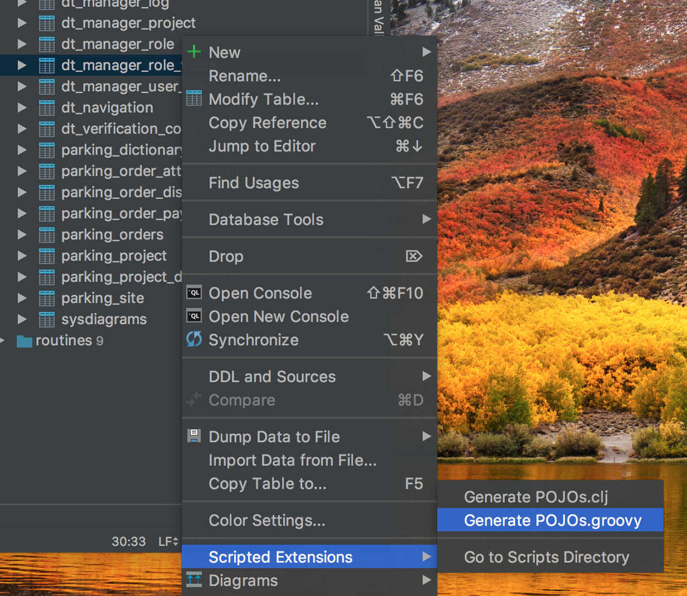
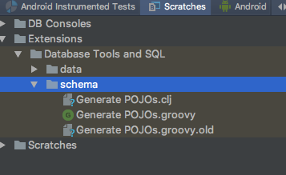

# VS Code
## 显示所有快捷键
> CMD + k CMD + s


# IntelliJ IDEA
## 注释

### 文件信息
**Editor -> File and Code Templates -> Files -> Class **


## 插件
### IdeaVim快捷键设置


## 修改阿里云插件


## 使用断言

##代码折叠
快捷键 cmd+opt+t		
visual studio style		

```java	
//region Description  	  
Your code goes here...  	  
//endregion 	
```
netbeans style

```java 	
// <editor-fold desc="Description">    
Your code goes here...    
// </editor-fold>  
```


##Intellij IDEA 从数据库生成 JPA Entity

首先，需要从调用 Database 窗口 `View>Tool Windows>Database`    
添加到数据库的连接		
选择数据的表，然后右击

选择 `Scripted Extensions > Generate POJOs.groovy` 既可以生成实体

Scripted Extensions 中前面2个菜单，是生成实体的模版，后面一个是实体模版所在的目录。实际使用中，我们需要对生成的模版代码修改

进入模版目录	

打开对应的模版文件进行修改, 下方是我修改后的模版文件和生成的代码

```groovy
import com.intellij.database.model.DasTable
import com.intellij.database.model.ObjectKind
import com.intellij.database.util.Case
import com.intellij.database.util.DasUtil

/*
 * Available context bindings:
 *   SELECTION   Iterable<DasObject>
 *   PROJECT     project
 *   FILES       files helper
 */

packageName = "com.sample;"
typeMapping = [
  (~/(?i)int/)                      : "long",
  (~/(?i)float|double|decimal|real/): "double",
  (~/(?i)datetime|timestamp/)       : "java.sql.Timestamp",
  (~/(?i)date/)                     : "java.sql.Date",
  (~/(?i)time/)                     : "java.sql.Time",
  (~/(?i)/)                         : "String"
]

FILES.chooseDirectoryAndSave("Choose directory", "Choose where to store generated files") { dir ->
  SELECTION.filter { it instanceof DasTable && it.getKind() == ObjectKind.TABLE }.each { generate(it, dir) }
}

def generate(table, dir) {
  def className = javaName(table.getName(), true)
  def fields = calcFields(table)
  new File(dir, className.replace('_', '') + ".java").withPrintWriter { out -> generate(out, className, fields) }
}

def generate(out, className, fields) {
  out.println "package $packageName"
  out.println ""
  out.println ""
  out.println "import lombok.Getter;"
  out.println "import lombok.Setter;"
  out.println "import javax.persistence.*;"
//  out.println "import java.sql.Timestamp;"
  out.println ""
  out.println "@Entity"
  out.println "@Table(name = \"${className.toLowerCase()}\")"
  out.println "@Setter @Getter"
  out.println "public class ${className.replace('_', '')} {"
  out.println ""
  fields.each() {
    if (it.annos != "") out.println "  ${it.annos}"

    if (it.name == 'id') {
        out.println "  @Id"
        out.println "  @GeneratedValue(strategy = GenerationType.IDENTITY)"
    }
    if (it.name.contains('_'))
      out.println "  @Column(name = \"${it.name.toLowerCase()}\")"
    out.println "  private ${it.type} ${it.name.replace('_', '')};"
    out.println ""
  }
  out.println "}"
}

def calcFields(table) {
  DasUtil.getColumns(table).reduce([]) { fields, col ->
    def spec = Case.LOWER.apply(col.getDataType().getSpecification())
    def typeStr = typeMapping.find { p, t -> p.matcher(spec).find() }.value
    fields += [[
                 name : javaName(col.getName(), false),
                 type : typeStr,
                 annos: ""]]
  }
}

def javaName(str, capitalize) {
  def s = str.split(/(?<=[^\p{IsLetter}])/).collect { Case.LOWER.apply(it).capitalize() }
          .join("").replaceAll(/[^\p{javaJavaIdentifierPart}]/, "_")
  capitalize || s.length() == 1? s : Case.LOWER.apply(s[0]) + s[1..-1]
}

```

```java
package com.sample;


import lombok.Getter;
import lombok.Setter;
import javax.persistence.*;

@Entity
@Table(name = "parking_orders")
@Setter @Getter
public class ParkingOrders {

  @Id
  @GeneratedValue(strategy = GenerationType.IDENTITY)
  private long id;

  @Column(name = "project_id")
  private long projectId;

  @Column(name = "site_id")
  private long siteId;

  @Column(name = "site_name")
  private String siteName;

  @Column(name = "order_no")
  private String orderNo;

  @Column(name = "order_amount")
  private double orderAmount;

  @Column(name = "discount_amount")
  private double discountAmount;

  @Column(name = "payable_amount")
  private double payableAmount;

  @Column(name = "real_amount")
  private double realAmount;

  @Column(name = "loan_status")
  private long loanStatus;

  @Column(name = "house_name")
  private String houseName;

  @Column(name = "customer_name")
  private String customerName;

  @Column(name = "customer_phone")
  private String customerPhone;

  @Column(name = "customer_code")
  private String customerCode;

  @Column(name = "manager_id")
  private long managerId;

  private long status;

  private String remark;

  @Column(name = "contract_no")
  private String contractNo;

  @Column(name = "check_code")
  private String checkCode;

  @Column(name = "add_time")
  private java.sql.Timestamp addTime;

  @Column(name = "confirm_time")
  private java.sql.Timestamp confirmTime;

  @Column(name = "complete_time")
  private java.sql.Timestamp completeTime;

}

```

