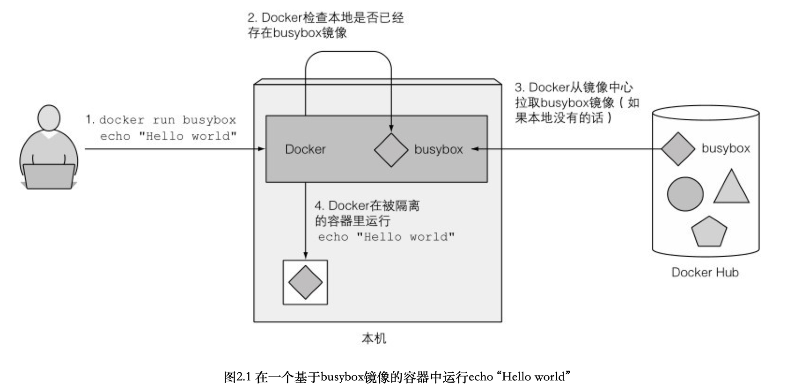
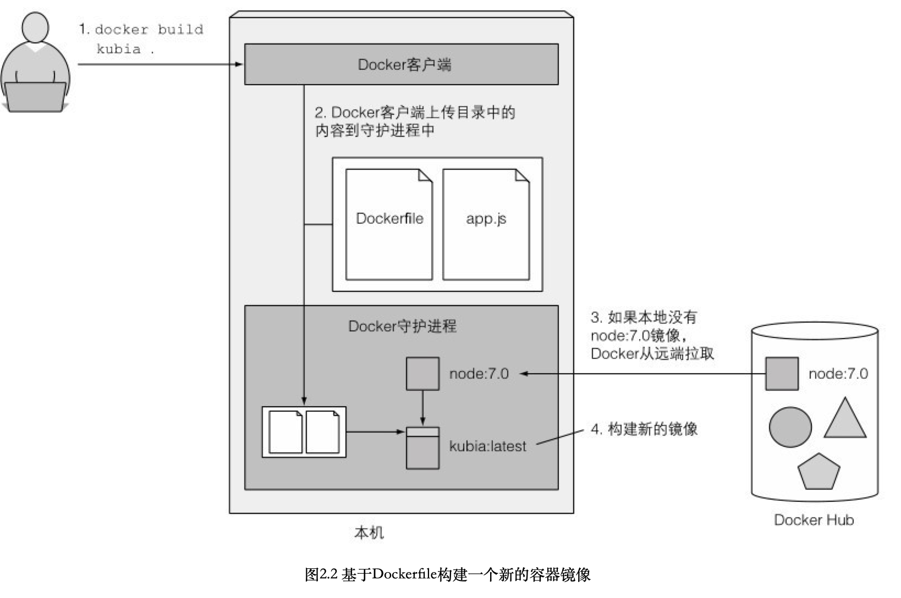

# Kubernetes In Action


## 介绍

#### 集群架构

* 主节点 承载着Kubernetes控制和管理整个集群系统的控制面板
* 工作节点 运行用户实际部署的应用


##### 控制面板

控制面板用于控制集群并使它工作。它包含多个组件，组件可以运行在单个主节点上或者通过副本分别部署在多个主节点以确保高可用性。这些组件是：

* KubernetesAPI服务器，你和其他控制面板组件都要和它通信

* Scheculer，它调度你的应用（为应用的每个可部署组件分配一个工作节点）

* ControllerManager，它执行集群级别的功能，如复制组件、持续跟踪工作节点、处理节点失败等

* etcd，一个可靠的分布式数据存储，它能持久化存储集群配置控制面板的组件持有并控制集群状态，但是它们不运行你的应用程序。这是由工作节点完成的。

##### 工作节点

工作节点是运行容器化应用的机器。运行、监控和管理应用服务的任务是由以下组件完成的：

* Docker、rtk或其他的容器类型
* Kubelet，它与API服务器通信，并管理它所在节点的容器
* Kubernetes Service Proxy（kubeproxy），它负责组件之间的负载均衡网络流量

## 开始使用Kubernetes 和 Docker

### 创建、运行及共享容器镜像

#### 运行一个hello world容器

##### 背后的原理



#### 为镜像创建Dockerfile

```dockerfile
FROM node:7										# 定义镜像的起始内容
ADD app.js /app.js						# 把 app.js 从本地文件夹加到镜像的根目录。保持文件名
ENTRYPOINT ["node", "app.js"] # 运行node命令
```

#### 构建容器镜像



##### 镜像的构建过程

构建过程不是由Docker客户端进行的，而是将整个目录的文件上传到Docker守护进程并在那里进行的。Docker客户端和守护进程不要求在同一台机器上。

> 不要在构建目录中包含任何不需要的文件，这样会减慢构建的速度——尤其当Docker守护进程运行在一个远端机器的时候。

##### 镜像分层


