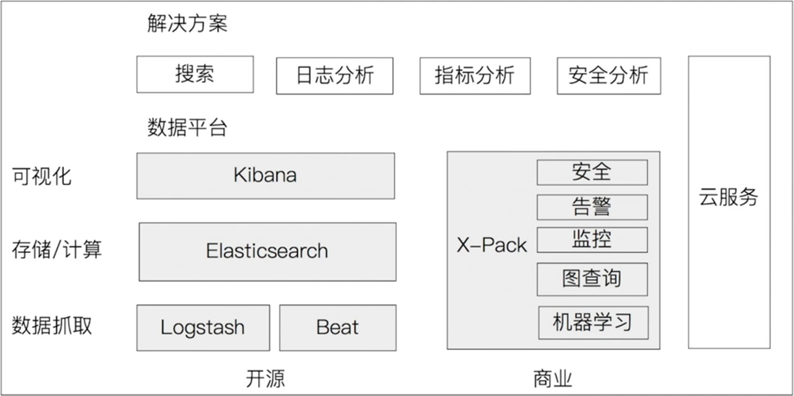
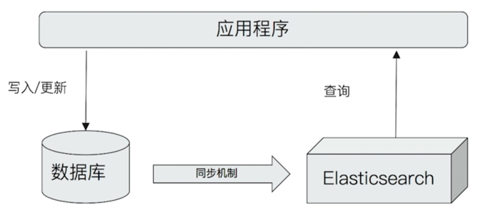

# Elasticsearch

## 概述

### 生态圈



### 与数据库集成


[官网](https://www.elastic.co/)

## Install

### MacOS单机部署

```bash
brew install elasticsearch
brew install kibana
```


### 集群安装

| 名称  | IP 地址      |
| ----- | ------------ |
| es-12 | 192.168.2.12 |
| es-13 | 192.168.2.13 |
| es-14 | 192.168.2.14 |

编辑 `vim /etc/security/limits.conf`

```bash
* soft nofile 65536
* hard nofile 65536
# 解决启动时的错误
# [1]: max file descriptors [4096] for elasticsearch process is too low, increase to at least [65536]
```

更改后需要重新登录用户

编辑 `vim /etc/sysctl.conf`

```bash
vm.max_map_count=655360
# 解决启动时的错误
# [2]: max virtual memory areas vm.max_map_count [65530] is too low, increase to at least [262144]
```

 执行命令 `sysctl -p`

开始安装

```bash
yum -y install java-1.8.0-openjdk
# 安装 elasticsearch-head 插件时需要
yum -y install nodejs 
# elasticsearch 不能使用root用户运行 
wget https://artifacts.elastic.co/downloads/elasticsearch/elasticsearch-6.6.2.tar.gz
tar -xvf elasticsearch-6.6.2.tar.gz
mv elasticsearch-6.6.2 /opt/es
adduser warriorg
passwd warriorg
cd /opt
chown -R warriorg es				# 赋权限
su warriorg
./elasticsearch -d 					# 运行 elasticsearch,只能本机访问
# 查看启动的进程
ps -aux | grep elasticsearch
```

修改配置文件  elasticsearch.yml

```bash
cluster.name: es-test
node.name: node-12
network.host: 0.0.0.0
```

配置防火墙

```bash
firewall-cmd --zone=public --add-port=9200/tcp --permanent
firewall-cmd --zone=public --add-port=9300/tcp --permanent
firewall-cmd --reload   # 使配置生效
firewall-cmd --list-all  # 检查配置
```

安装[elasticsearch-head](http://mobz.github.io/elasticsearch-head)插件,  **当然也可以chrome的插件,感觉效果更好!!**
```bash
cd /opt
git clone git://github.com/mobz/elasticsearch-head.git
cd elasticsearch-head
npm install
npm run start
```
==es-12== elasticsearch.yaml 

```bash
cluster.name: es-test
node.name: node-12
node.master: true
network.host: 0.0.0.0
http.port: 9200
discovery.zen.ping.unicast.hosts: ["192.168.2.12:9300", "192.168.2.13:9300", "192.168.2.14:9300"]
discovery.zen.minimum_master_nodes: 2
http.cors.enabled: true
http.cors.allow-origin: "*"
```
==es-13== elasticsearch.yaml 

```bash
cluster.name: es-test
node.name: node-13
node.master: true
network.host: 0.0.0.0
http.port: 9200
discovery.zen.ping.unicast.hosts: ["192.168.2.12:9300", "192.168.2.13:9300", "192.168.2.14:9300"]
discovery.zen.minimum_master_nodes: 2
http.cors.enabled: true
http.cors.allow-origin: "*"
```
==es-14== elasticsearch.yaml 

```bash
cluster.name: es-test
node.name: node-14
node.master: true
network.host: 0.0.0.0
http.port: 9200
discovery.zen.ping.unicast.hosts: ["192.168.2.12:9300", "192.168.2.13:9300", "192.168.2.14:9300"]
discovery.zen.minimum_master_nodes: 2
http.cors.enabled: true
http.cors.allow-origin: "*"
```

### 集群健康

`status` 字段指示着当前集群在总体上是否工作正常。它的三种颜色含义如下：

- **green **所有的主分片和副本分片都正常运行。
- **yellow **所有的主分片都正常运行，但不是所有的副本分片都正常运行。
- **red** 有主分片没能正常运行。

#### 集群信息查看

| uri                               | method | 描述                       |
| --------------------------------- | ------ | -------------------------- |
| /_cat/                            | GET    | 集群信息查询列表           |
| /_cat/health?v                    | GET    | 集群状态                   |
| /_nodes/stats/process?pretty      | GET    | node状态信息               |
| /_cat/nodes?v                     | GET    | 查看每个node的机器使用情况 |
| /_cat/indices?v                   | GET    | 查看集群的索引信息         |
| /_cat/indices?v&health=yellow     | GET    | 只显示状态为黄色的         |
| /_cat/indices?v&s=docs.count:desc | GET    | 根据文档数降序排序         |
| /_cat/indices?v&h=i,tm&s=tm:desc  | GET    | 显示每个索引占的内存       |
| /_cat/allocation?v                | GET    | node使用的磁盘情况         |
| /_cat/count?v                     | GET    | 查看文档数                 |
| /_cat/fielddata?v                 | GET    | fieldData的大小            |
| /_cat/fielddata?v&fields=test     | GET    | 查看指定的字段             |
| /_cat/master?v                    | GET    | 主节点信息                 |
| /_cat/recovery?v                  | GET    | 分片的恢复                 |

### elasticsearch.yml

```bash
# 默认启动的集群名字叫 elasticsearch 。 你最好给你的生产环境的集群改个名字，改名字的目的很简单， 就是防止某人的笔记本电脑加入了集群这种意外
cluster.name: elasticsearch_production
# 节点名称,每格几点名字不同,默认情况下自动生成,从ES的jar中的config文件下的name.txt中随机取出名字
node.name: node-12
# 是否允许该节点成为master(默认开启); ES启动时使用第一个节点为master,如果挂掉会从允许为master的节点中选举出来一个新的.
node.master: true
node.attr.rack: r1
# 该节点上允许出现的实例数,如果一个节点一个ES服务就不需要,如果需要在单台躲开就要改
node.max_local_storage_nodes=3
path.data: /path/to/data
path.logs: /path/to/logs
bootstrap.memory_lock: true
network.host: 192.168.0.1
http.port: 9200
# Elasticsearch 默认被配置为使用单播发现，以防止节点无意中加入集群。只有在同一台机器上运行的节点才会自动组成集群。
# master节点的初始列表;会探索,但是如果网络不稳定,会出现脑裂,最好加上node的信息
discovery.zen.ping.unicast.hosts: ["host1", "host2"]
# 集群中最小节点数,防止脑裂一般为:节点数/2+1. 例如: 网络中5个节点最小master是2,当网络故障后形成2个集群,通了后又变成一个.数据会严重错乱或无法工作
discovery.zen.minimum_master_nodes: 2
gateway.recover_after_nodes: 3
action.destructive_requires_name: true

# head访问
http.cors.enabled: true
http.cors.allow-origin: "*"
```


## 基本概念

### 索引

#### 定义

* Index 索引时文档的容器，是一类文档的结合
  * Index 体现了逻辑空间的概念：每个索引都有自己的Mapping定义，用于定义包含的文档的字段和字段类型
  * Shard 体现了物理空间的概念：索引中的数据分散在Shard上
* 索引的Mapping与Settings
  * Mapping 定义文档字段的类型
  * Settings 定义不同的数据分布

#### 索引的不同语意

* 名词 一个Elasticsearch集群中，可以创建很多不同的索引
* 动词 保存一个文档到Elasticsearch的过程也叫索引
  * ES中，创建一个倒排索引的过程
* 名词 一个B树索引，一个倒排索引


#### 与传统数据库对比

| RDBMS  | Elasticsearch |
| ------ | ------------- |
| Table  | Index(Type)   |
| Row    | Document      |
| Column | Field         |
| Schema | Mapping       |
| SQL    | DSL           |


### 文档

#### 定义

* Elasticsearch是面向文档的，文档时所有可搜索数据的最小单位
  * 日志文件中的日志项
  * 一本电影的具体信息/一张唱片的详细信息
  * MP3播放器里的一首歌/一篇PDF文档中的具体内容
* 文档会被序列化成JSON格式，保存在Elasticsearch中
  * JSON对象由字段组成
  * 每个字段都有对应的字段类型
* 每个文档都有一个Unique ID
  * 可以自己指定ID
  * 通过Elasticsearch自动生成
* 一篇文档包含了一系列字段。类似数据库表中一条记录
* JSON文档，格式灵活，不需要预先定义格式
  * 字段的类型可以指定或者通过Elasticsearch自动推算
  * 支持数组/支持嵌套

#### 文档的元数据

用于标注文档的相关信息

| 类型     | 说明                               |
| -------- | ---------------------------------- |
| _index   | 文档所属的索引名                   |
| _type    | 文档所属的类型名                   |
| _id      | 文档唯一ID                         |
| _source  | 文档的原始Json数据                 |
| _all     | 整合所有字段内容到该字段，已被废除 |
| _version | 文档的版本信息                     |
| _score   | 相关性打分                         |

#### CRUD

| 命令   | 示例                                                         |
| ------ | ------------------------------------------------------------ |
| Index  | PUT `my_index/_doc/1 {"user":"mike", "comment":"for search"}` |
| Create | PUT `my_index/_create/1 {"user":"mike", "comment":"for search"}` <br/>POST `my_index/_doc(不指定ID，自动生成) {"user":"mike", "comment":"for search"}` |
| Read   | GET my_index/_doc/1                                          |
| Update | POST my_index/_update/1 {"doc":{"user":"mike", "comment":"hello world"}} |
| Delete | DELETE my_index/_doc/1                                       |

* Type 名，约定都用_doc
* Create  如果ID已经存在，会失败
* Index 如果ID不存在，创建新的文档。否则，先删除现有的文档，在创建新的文档，版本会增加
* Update 文档必须已经存在，更新只会对相应字段做增量修改

##### 实例

```bash
# create document. 自动生成_id
POST users/_doc 
{
  "user": "Mike",
  "post_date": "2019-10-05T14:12:12",
  "message": "hello world"
}

# create document. 指定ID， 如果ID已经存在，报错
PUT users/_doc/1?op_type=create
{
  "user": "Jack",
  "post_date": "2019-10-05T14:12:12",
  "message": "elasticsearch"
}

# create document. 指定ID， 如果ID已经存在，报错
PUT users/_create/2
{
  "user": "Jack",
  "post_date": "2019-10-05T14:12:12",
  "message": "elasticsearch"
}

GET users/_doc/1
# index
PUT users/_doc/1 
{
  "user": "mike"
}

# update
POST users/_update/1
{
  "doc": {
    "post_date": "2019-10-05T14:12:12",
    "message": "elasticsearch"
  }
}

# delete
DELETE /users/_doc/1
```


### REST API

批量操作中不要发送过多的数据，一般的建议是1000-5000个文档，大小建议是5-15MB，默认不能超过100MB


#### Bulk API

* 支持在一次API调用中，对不同的索引进行操作
* 支持四种类型操作
  * Index
  * Create
  * Update
  * Delete
* 可以再URI中指定Index，也可以在请求的Payload中进行
* 操作中单条操作失败，并不影响其他操作
* 返回结果包括了每一条操作执行的结果

##### demo

```
POST _bulk
{"index":{"_index":"test", "_id": "1"}}
{"field1": "value1"}
{"delete":{"_index":"test", "_id": "2"}}
{"create":{"_index":"test2", "_id": "3"}}
{"field1": "value3"}
{"update":{"_id": "3", "_index":"test"}}
{"doc":{"field2": "value2"}}
```

#### mget 批量读取

##### demo

```bash
GET _mget
{
  "docs": [{"_index":"users", "_id":1}, 
  {"_index":"test", "_id":1}]
}
```

#### search 批量查询

##### demo

```bash
GET _msearch
{}
{"query":{"match_all":{}}, "from":0, "size": 10}
{}
{"query":{"match_all":{}}}
{"index": "users"}
{"query":{"match_all":{}}}
```


### 节点

#### 定义

* 节点是一个Elasticsearch的实例
* 每一个节点都有名字，通过配置文件配置，或者启动时候 `-E node.name=node1`指定
* 每一个节点在启动之后，会分配一个UID，保存在data目录下

#### Master-eligible nodes 和 Master Node

* 每个节点启动后，默认就是一个Master eligible 节点
* Master-eligible节点可以参加选主流程，成为Master节点
* 每个节点上都保存了集群的状态，只有Master节点才能修改集群的状态信息
  * 集群状态（Cluster State），维护一个集群中必要的信息
    * 所有的节点信息
    * 所有的索引和其相关的Mapping与Setting信息
    * 分片的路由信息
  * 任意几点都能修改信息会导致数据的不一致性


#### DataNode

负责保存分片数据，在数据扩展上起到了至关重要的作用

#### Coordinating Node

* 负责接受Client的请求，将请求分发到合适的节点，最终把结果汇集到一起
* 每个节点默认都起到了Coordination Node的职责

#### Hot & Warm Node

不同硬件配置的Data Node，用来实现Hot&Warm架构，降低集群部署的成本

#### Machine Learning Node

负责跑，机器学习的Job，用来做异常检测

#### Tribe Node

Tribe Node连接到不同的Elasticsearch‘集群，并且支持将这些集群当成一个单独的集群处理

### 集群

### 分片

#### 主分片

用以解决数据水平扩展的问题，通过主分片，可以将数据分布到集群内的所有节点上

* 一个分片是一个运行的Lucene的实例
* 主分片数在索引创建时指定，后续不允许修改，除非Reindex

#### 副本

用以解决数据高可用的问题。分片时主分片的拷贝

* 副本分片数，可以动态调整
* 增加副本数，还可以在一定程度上提高服务的可用性（读取的吞吐）

#### 分片的设定

* 对于生产环境中分片的设定，需要提前做好容量的规划
  * 分片数设置过小
    * 导致后续无法增加节点实现水平扩展
    * 单个分片的数据量太大，导致数据重新分配耗时
  * 分片数设置过大，7.0开始，默认主分片设置成1，解决了over-sharding的问题
    * 影响搜索结果的相关性打分，影响统计结果的准确性
    * 单个节点上过多的分片，会导致资源浪费，同时也会影响性能


#### demo

```bash
# 集群的健康情况
GET _cluster/health
GET _cat/nodes
GET _cat/shards

GET _nodes/es01,es02
GET _cat/nodes?v
GET _cat/nodes?v&h=id,ip,port,v,m

GET _cluster/health
GET _cluster/health?level=shards
```


### 倒排索引

#### 正排索引

正排索引是指文档ID为key，表中记录每个关键词出现的次数，查找时扫描表中的每个文档中字的信息，直到找到所有包含查询关键字的文档。

* 优点是：易维护；

* 缺点是：搜索的耗时太长；

#### 倒排索引

由于正排的耗时太长缺点，倒排就正好相反，是以word作为关键索引。表中关键字所对应的记录表项记录了出现这个字或词的所有文档，一个表项就是一个字表段，它记录该文档的ID和字符在该文档中出现的位置情况。

倒排包含两部分：

* 单词词典(Term Dictionary) 记录所有文档的单词，记录单词到倒排列表的关联关系
  * 单词词典一般比较大，可以通过B+树或哈希拉链法实现，以满足高性能的出入与查询
* 倒排列表(Posting List) 记录了单词对应的文档结合，有倒排索引项组成
  * 倒排索引项(Posting)
    * 文档 ID
    * 词频 TF - 该单词在文档中出现的次数，用于相关性评分
    * 位置(Position) - 单词在文档中分词的位置。用于语句搜索（phrase query）
    * 便宜(Offset) - 记录单词的开始结束位置，实现高亮显示

倒排的优缺点和正排的优缺点整好相反。倒排在构建索引的时候较为耗时且维护成本较高，但是搜索耗时短。


####  Elasticsearch中的倒排索引

* Elasticsearch的JSON文档中的每个字段，都有自己的倒排索引
* 可以指定对某些字段不做索引
  * 优点 节省存储空间
  * 缺点 字段无法被搜索

### Analysis 与 Analyzer

* Analysis - 文本分析是把全文本转换一系列单词（term/token）的过程，也叫分词
* Analysis - 是通过Analyzer来实现的
  * 可使用Elasticsearch内置的分析器/或者按需定制化分析器
* 除了在数据写入时转换词条，匹配Query语句时候也需要用相同的分析器对查询语句进行分析

#### Analyzer 的组成

分词器是专门处理分词的组件，Analyzer由三部分组成

* Character Filters 针对原始文本处理，例如去除Html
* Tokenizer 按照规则切分为单词
* Token Filter 将切分的单词进行加工，小写，删除stopwords，增加同义词


 #### 内置的分词器

- Standard Analyzer 默认分词器，按词切分，小写处理
- Simple Analyzer 按照非字母切分（符号被过滤），小写处理
- Stop Analyzer 小写处理，停用词过滤（the,a,is）
- Whitespace Analyzer 按照空格切分，不转小写
- Keyword Analyzer 不分词，直接将输入当做输出
- Pattern Analyzer 正则表达式，默认\W+（非字符分割）
- Language 提供了30多种常见语言的分词器
- Customer Analyzer自定义分词器


#### icu analyzer

- 需要安装plugin
  - Elasticsearch-plugin install analysis-icu
- 提供了unicode的支持，更好的支持亚洲语言

#### 其他的中文分词

* IK
* THULAC

#### demo

```bash
GET _analyze
{
  "analyzer": "standard",
  "text": "2 running Quick brown-foxes leap over lazy dogs in the summer evening."
}

GET _analyze
{
  "analyzer": "simple",
  "text": "2 running Quick brown-foxes leap over lazy dogs in the summer evening."
}

GET _analyze
{
  "analyzer": "stop",
  "text": "2 running Quick brown-foxes leap over lazy dogs in the summer evening."
}

GET _analyze
{
  "analyzer": "whitespace",
  "text": "2 running Quick brown-foxes leap over lazy dogs in the summer evening."
}

GET _analyze
{
  "analyzer": "keyword",
  "text": "2 running Quick brown-foxes leap over lazy dogs in the summer evening."
}

GET _analyze
{
  "analyzer": "pattern",
  "text": "2 running Quick brown-foxes leap over lazy dogs in the summer evening."
}

GET _analyze
{
  "analyzer": "english",
  "text": "2 running Quick brown-foxes leap over lazy dogs in the summer evening."
}

# 需要安装
GET _analyze
{
  "analyzer": "icu_analyzer",
  "text": "你说的都对的"
}
```

### Search API

指定查询的索引

| 语法                   | 范围              |
| ---------------------- | ----------------- |
| _search                | 集群上所有的索引  |
| index1/_search         | Index1            |
| index1，index2/_search | index1和index2    |
| index*/_search         | 以index开头的索引 |


#### URI Search

在URL中使用查询参数

* 使用`q`,指定查询字符串， "query string syntax", KV健值对
* df 默认字段，不指定时，会对所有字段进行查询
* Sort排序 / from 和 size 用于分页
* Profile 可以查看查询时如何被执行的


##### Query String syntax

* 指定字段 vs 泛查询

  * q=title:2012   / q= 2012
* Term vs Phrase

  * Beautiful Mind 等效于 Beautiful OR Mind
  * "Beautiful Mind",等效于Beautiful And Mind. Phrase 查询，还要求前后顺序保持一致
* 分组于引号

  * title:(Beautiful And Mind)
  * title = "Beautiful Mind"
* 布尔操作
  * AND / OR / NOT 或者 && / || / !
    * 必须大写
    * title:(matrix NOT reloaded)
* 分组
  * `+` 表示 must
  * `-` 表示must_not
  * title:(+matrix -reloaded)
* 范围查询
  * 区间表示 [] 闭区间， {} 开区间
    * `year:{2019 TO 2018}`
    * `year:{* TO 2018}`
* 算数符号

  * `year:>2010`
  * `year:(>2010 && <=2018)`
  * `year:(+>2010 + <=2018)`
* 通配符查询（通配符查询效率底，占用内存大，不建议使用。特别是放在最前面)

  * `?` 代表1个字符

  * `*` 代表0或多个字符

    * `title:mi?d`

    * `title:be*`
*     正则表达式

      *     title:[bt]oy
* 模糊匹配与近似查询
  *   `title:befutifl~1`
  *   `title:"lord rings"~2`


##### demo

```bash
curl -XGET "http://es01:9200/kibana_sample_data_ecommerce/_search?q="customer_first_name:Eddie"
```

```bash
GET /movies/_search?q=2012&df=title&sort=year:desc&from=0&size=10&timeout=1s
# 带 profile 查看查询时如何被执行的
GET /movies/_search?q=2012&df=title
{
  "profile": "true"
}
# 范查询，正对_all，所有的字段
GET /movies/_search?q=2012
# 指定字段
GET /movies/_search?q=title:2012
# 使用引号, Phrase 查询
GET /movies/_search?q=title:"Beautiful Mind"
# Mind 为泛查询
GET /movies/_search?q=title:Beautiful Mind
# 分组，Bool查询
GET /movies/_search?q=title:(Beautiful Mind)
GET /movies/_search?q=title:(Beautiful AND Mind)
GET /movies/_search?q=title:(Beautiful NOT Mind)
# %2B url 中等同于+号
GET /movies/_search?q=title:(Beautiful %2BMind)
# 范围查询，区间写法 / 数学写法
GET /movies/_search?q=year:>=2018
# 通配符查询
GET /movies/_search?q=title:b*
# 模糊匹配&近似度匹配
GET /movies/_search?q=title:beautifl~1
GET /movies/_search?q=title:"Lord Rings"~2
```


#### Request Body Search

基于JSON格式的更加完备的Query Domain Specific Language （DSL）

* 将查询语句通过 HTTP Request Body 发送给 Elasticsearch
* Query DSL


##### demo

```bash
# 支持POST和GET
curl -XGET "http://es01:9200/kibana_sample_data_ecommerce/_search -H 'Content-type: application/json' -d'{"query":{"match_all":{}}}'
```

```bash
# 对日期排序
POST kibana_sample_data_ecommerce/_search
{
  "sort":[{"order_date":"desc"}],
  "query":{
    "match_all":{}
  }
}

# source filtering
POST kibana_sample_data_ecommerce/_search
{
  "_source":["order_date"],
  "query": {
    "match_all": {}
  }
}

# 脚本字段
GET kibana_sample_data_ecommerce/_search
{
  "profile": "true",
  "script_fields": {
    "new_field": {
      "script": {
        "lang": "painless",
        "source": "doc['order_date'].value+'_hello'"
      }
    }
  },
  "query": {
    "match_all": {}
  }
}

# match query or 
POST movies/_search
{
  "profile": "true",
  "query": {
    "match": {
      "title": "Last Christmas"
    }
  }
}

# match query and
POST movies/_search
{
  "profile": "true",
  "query": {
    "match": {
     "title": {
        "query": "Last Christmas",
        "operator": "and"
     }
    }
  }
}

# match phrase
POST movies/_search
{
  "query": {
    "match_phrase": {
      "title": {
        "query": "one love"
      }
    }
  }
}

# match phrase
POST movies/_search
{
  "query": {
    "match_phrase": {
      "title": {
        "query": "one love",
        "slop": 1
      }
    }
  }
}
```

### Query String & Simple Query String 查询

#### Query String

```bash
# 造数据
PUT /users/_doc/1
{
  "name": "Ruan Yiming",
  "about": "java, golang, node, swift, elasticsearch"
}

PUT /users/_doc/2
{
  "name": "li Yiming",
  "about": "Hadoop"
}

POST users/_search
{
  "query": {
    "query_string": {
      "default_field": "name",
      "query": "Ruan AND Yiming"
    }
  }
}


POST users/_search
{
  "query": {
    "query_string": {
      "fields": ["name", "about"],
      "query": "(Ruan AND Yiming) OR (Java and elasticsearch)"
    }
  }
}
```


#### Simple Query String

* 类似Query String，但是会忽略错误的语法，同时只支持部分查询语法
* 不支持 AND OR NOT, 会当作字符串处理
* Term 之间默认的关系是OR， 可以指定Operator
* 支持部分逻辑
  * `+` 替代 AND
  * `|` 替代 OR
  * `-` 替代 NOT

```bash
# Simple Query 默认的 operator 是 OR
POST users/_search
{
  "query": {
		"simple_query_string": {
			"query": "Ruan -Yiming",
			"fields": ["name"]
		}
	}
}
POST users/_search
{
  "query": {
		"simple_query_string": {
			"query": "Ruan Yiming",
			"fields": ["name"],
			"default_operator": "AND"
		}
	}
}

```

### Dynamic Mapping
#### 什么是Mapping


## 索引管理

### 字段类型

| 一级分类 | 二级分类 | 具体类型                             | 备注                                                         |
| ------------- | -------- | ------------------------------------ | ------------------------------------------------------------ |
| 核心     | 字符串   | string                               | 新版不再使用                                                 |
|          |          | text                                 | 全文搜索的内容,会模糊匹配,会被拆分然后建立倒序索引,不用于排序,聚合也少用 |
|          |          | keyword                              | 会拆分,适用于排序聚合等,精确匹配                             |
|          | 整数     | integer,long,short,byte              |                                                              |
|          | 浮点     | double,float,half_float,scaled_float |                                                              |
|          | 逻辑     | boolean                              |                                                              |
|          | 日期     | date                                 |                                                              |
|          | 范围     | range                                |                                                              |
|          | 二进制   | binary                               |                                                              |
| 复合     | 数组     | array                                |                                                              |
|          | 对象     | object                               |                                                              |
|          | 嵌套     | nested                               |                                                              |
| 地理     | 地理坐标 | geo_point                            |                                                              |
|          | 地理地图 | geo_shape                            |                                                              |
| 特殊     | IP       | ip                                   |                                                              |
|          | 范围     | completion                           |                                                              |
|          | 令牌计数 | token_count                          |                                                              |
|          | 附件     | attachment                           |                                                              |
|          | 抽取     | percolator                           |                                                              |

### DSL语法

