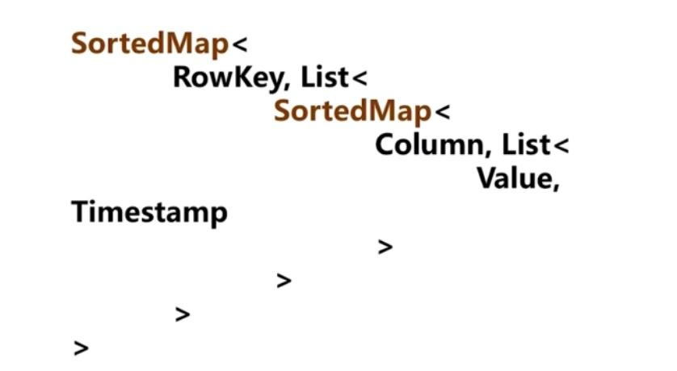

# HBASE

## 架构

## 安装

### 单机安装

```bash
brew install hbase  
brew services start hbase
```

打开http://localhost:16010查看Hbase的Web UI


## 操作

```bash
hbase shell   # 连接hbase
>help    # 帮助信息
>create 'test', 't1', 't2' # 创建一个表，必须要指定表名称和列簇名
>list 'test'  # 列出表的信息
>describe 'test' # 查看表的详细信息
>put 'test', 'row1', 't2:b', 't2b'  
>put 'test', 'row1', 't1:a', 't1a'	# 在表中添加数据
>scan 'test' 		# 查看表中的所有数据
>get 'test', 'row1'  # 获取单行的数据
>disable 'test'   # 停用表
>drop 'test'   # drop掉，必须先disable
>quit
```


## 理论基础

### 数据模型

- Table：Hbase的table由多个行组成
- Row：一个行在Hbase中由一个或多个有值的列组成。Row按照字母进行排序，因此行健的设计非常重要。这种设计方式可以让有关系的行非常的近，通常行健的设计是网站的域名反转，比如(org.apache.www, org.apache.mail, org.apache.jira)，这样的话所有的Apache的域名就很接近。
- Column：列由列簇加上列的标识组成，一般是“列簇：列标识”，创建表的时候不用指定列标识
- Column Family：列簇在物理上包含了许多的列与列的值，每个列簇都有一些存储的属性可配置。例如是否使用缓存，压缩类型，存储版本数等。在表中，每一行都有相同的列簇，尽管有些列簇什么东西也没有存。
- Column Qualifier：列簇的限定词，理解为列的唯一标识。但是列标识是可以改变的，因此每一行可能有不同的列标识
- Cell：Cell是由row，column family,column qualifier包含时间戳与值组成的，一般表达某个值的版本
- Timestamp：时间戳一般写在value的旁边，代表某个值的版本号，默认的时间戳是你写入数据的那一刻，但是你也可以在写入数据的时候指定不同的时间戳

HBase 是一个稀疏的、分布式、持久、多维、排序的映射，它以行键（row key），列键（column key）和时间戳（timestamp）为索引。

Hbase在存储数据的时候，有两个SortedMap，首先按照rowkey进行字典排序，然后再对Column进行字典排序。



### Hbase与关系型数据库对比

| 属性     | Hbase                | RDBMS                  |
| -------- | -------------------- | ---------------------- |
| 数据类型 | 只有字符串           | 丰富的数据类型         |
| 数据操作 | 增删改查，不支持join | 各种各样的函数与表连接 |
| 存储模式 | 基于列式存储         | 基于表结构和行式存储   |
| 数据保护 | 更新后仍然保留旧版本 | 替换                   |
| 可伸缩性 | 轻易增加节点         | 需要中间层，牺牲性能   |

### Hbase设计时要考虑的因素

Hbase关键概念：表，rowkey，列簇，时间戳

- 这个表应该有多少列簇
- 列簇使用什么数据
- 每个列簇有有多少列
- 列名是什么，尽管列名不必在建表时定义，但读写数据是要知道的
- 单元应该存放什么数据
- 每个单元存储多少时间版本
- 行健(rowKey)结构是什么，应该包含什么信息


### 设计要点

#### 行健设计

关键部分，直接关系到后续服务的访问性能。如果行健设计不合理，后续查询服务效率会成倍的递减。

- 避免单调的递增行健，因为Hbase的行健是有序排列的，这样可能导致一段时间内大部分写入集中在某一个Region上进行操作，负载都在一台节点上。可以设计成： `[metric_type]` `[event_timestamp]`，不同的metric_type可以将压力分散到不同的region上
- 行健短到可读即可，因为查询短键不必长键性能好多少，所以设计时要权衡长度。
- 行健不能改变，**唯一可以改变的方式是先删除后插入**

#### 列簇设计

列簇是一些列的集合，一个列簇的成员有相同的前缀，以冒号(:)作为分隔符。

- 现在Hbase不能很好处理2~3个以上的列簇，所以尽可能让列簇少一些，如果表有多个列簇，列簇A有100万行数据，列簇B有10亿行，那么列簇A会分散到很多的Region导致扫描列簇A的时候效率底下。
- 列簇名的长度要尽量小，一个为了节省空间，另外加快效率，比如d表示data，v表示value

#### 列簇属性配置

- HFile数据块，默认是64KB，数据库的大小影响数据块索引的大小。数据块大的话一次加载进内存的数据越多，扫描查询效果越好。但是数据块小的话，随机查询性能更好

```
> create 'mytable',{NAME => 'cf1', BLOCKSIZE => '65536'}
```

- 数据块缓存，数据块缓存默认是打开的，如果一些比较少访问的数据可以选择关闭缓存

```
> create 'mytable',{NAME => 'cf1', BLOCKCACHE => 'FALSE'}
```

- 数据压缩，压缩会提高磁盘利用率，但是会增加CPU的负载，看情况进行控制

```
> create 'mytable',{NAME => 'cf1', COMPRESSION => 'SNAPPY'}
```

Hbase表设计是和需求相关的，但是遵守表设计的一些硬性指标对性能的提升还是很有帮助的，这里整理了一些设计时用到的要点。


[event_timestamp]: 