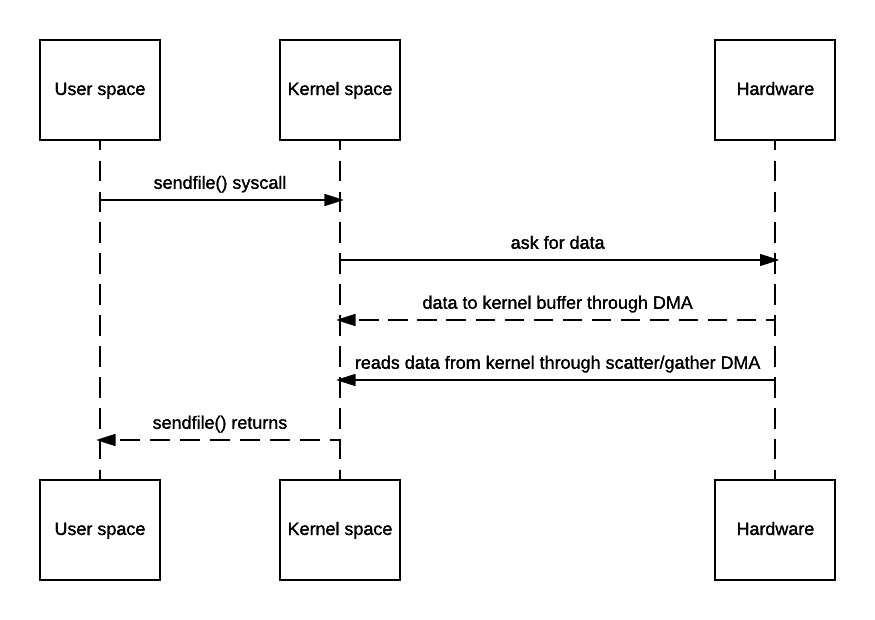
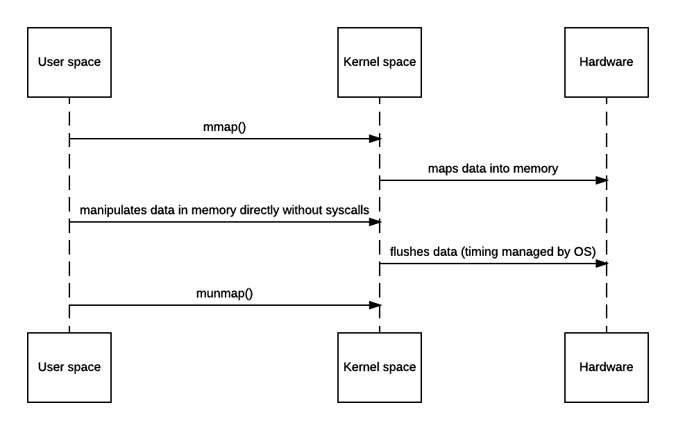
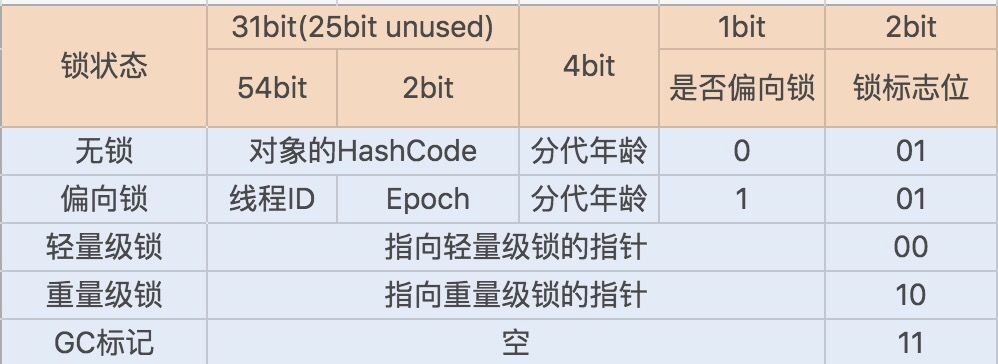
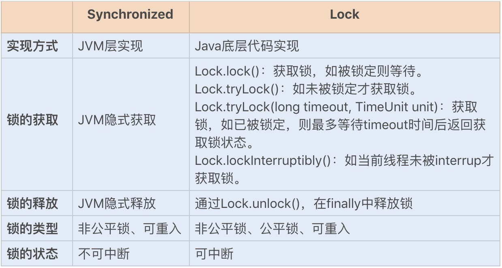
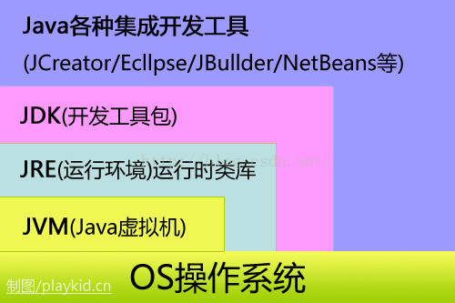
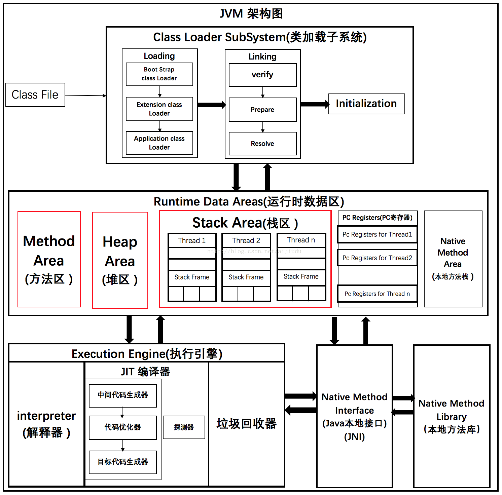
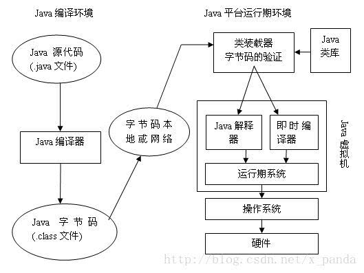
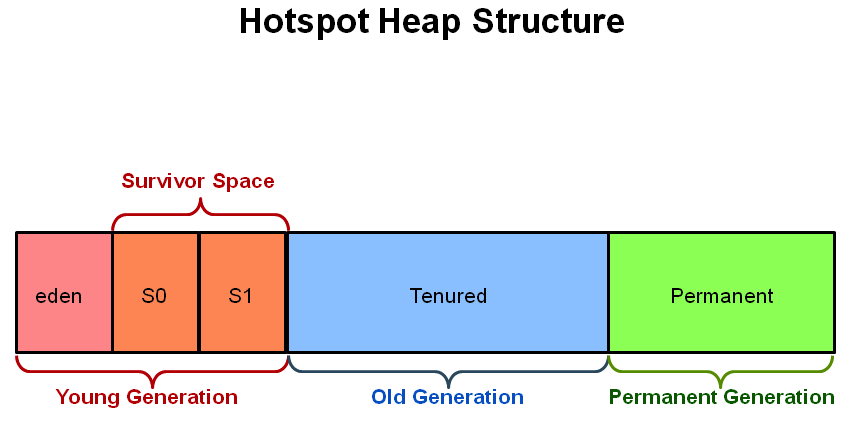
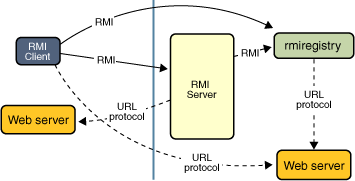

## 语言特性

### 类型

#### 基本类型（primitive types）

##### 整数型

- `byte` - 8 位。
- `short` - 16 位。
- `int` - 32 位。
- `long` - 64 位，赋值时一般在数字后加上 `l` 或 `L`。

##### 浮点型

- `float` - 32 位，直接赋值时必须在数字后加上 `f` 或 `F`。
- `double` - 64 位，赋值时一般在数字后加 `d` 或 `D` 。

##### 字符型

- `char` - 16 位，存储 Unicode 码，用单引号赋值。

##### 布尔型

- `boolean` - 只有 true 和 false 两个取值。


#### 引用类型 （reference types）

1. 类
2. 接口
3. 数组类
4. 泛型参数

## 类加载


1. 加载 查找和导入Class文件；
2. 连接 把类的二进制数据合并到JRE中；
   1. 校验 检查载入Class文件数据的正确性；
   2. 准备 给类的静态变量分配存储空间；
   3. 解析 将符号引用转成直接引用；
3. 初始化 对类的静态变量，静态代码块执行初始化操作

## NIO

### 原理

#### 正常copy


#### Zero copy


#### DMZ copy



#### mmap




### Channel

Java NIO Channels 和 streams 的区别

* Channels可以进行读写操作。Streams通常是单向的(读或写)。
* Channels可以异步读写
* Channels总是读写缓冲区

### Buffer


## 多线程

### Synchronized 

#### 实现原理

JVM中的同步是基于进入和退出管程(Monitor)对象实现的，每一个对象实例都会有一个Monitor，Monitor可以和对象一起创建、销毁。Monitor是由ObjectMonitor实现，ObjectMonitor由C++实现

#### 锁升级
##### Java 对象头

JDK1.6 JVM 对象实例在堆内存中被分为3部分

1. 对象头
   1. Mark Word
   2. 指向类的指针
   3. 数组长度
2. 实例数据
3. 对齐填充

64位JVM的存储结构



<u>Synchronized同步锁就是从偏向锁开始的，随着竞争越来越激烈，偏向锁升级到轻量级锁，最终升级到重量级锁</u>

##### 偏向锁

##### 轻量级锁

##### 自旋锁

##### 重量级锁


### Lock同步锁

Lock 锁的基本操作是通过乐观锁来实现的，但由于 Lock 锁也会在阻塞时被挂起，因此它依然属于悲观锁。



从性能方面上来说，在并发量不高、竞争不激烈的情况下，Synchronized 同步锁由于具有分级锁的优势，性能上与 Lock 锁差不多；但在高负载、高并发的情况下，Synchronized 同步锁由于竞争激烈会升级到重量级锁，性能则没有 Lock 锁稳定。

#### 实现原理

从性能方面上来说，在并发量不高、竞争不激烈的情况下，Synchronized 同步锁由于具有分级锁的优势，性能上与 Lock 锁差不多；但在高负载、高并发的情况下，Synchronized 同步锁由于竞争激烈会升级到重量级锁，性能则没有 Lock 锁稳定。

AQS 类结构中包含一个基于链表实现的等待队列（CLH 队列），用于存储所有阻塞的线程，AQS 中还有一个 state 变量，该变量对 ReentrantLock 来说表示加锁状态。


## JVM

### JDK、JRE与JVM的关系



### JVM 运行模式

JVM有两种运行模式Server与Client。两种模式的区别在于，Client模式启动速度较快，Server模式启动较慢；但是启动进入稳定期长期运行之后Server模式的程序运行速度比Client要快很多。这是因为Server模式启动的JVM采用的是重量级的虚拟机，对程序采用了更多的优化；而Client模式启动的JVM采用的是轻量级的虚拟机。所以Server启动慢，但稳定后速度比Client远远要快。


### JVM架构



#### 1. 类加载器子系统

Java的动态类加载功能是由类加载器子系统处理。当它在运行时（不是编译时）首次引用一个类时，它加载、链接并初始化该类文件。

##### 1.1 加载

类由此组件加载。启动类加载器 (BootStrap class Loader)、扩展类加载器(Extension class Loader)和应用程序类加载器(Application class Loader) 这三种类加载器帮助完成类的加载。

\1. **启动类加载器** – 负责从启动类路径中加载类，无非就是**rt.jar**。这个加载器会被赋予最高优先级。

\2. **扩展类加载器** – 负责加载**ext** 目录**(jre\lib)**内的类**.**

\3. **应用程序类加载器** – 负责加载**应用程序级别类路径**，涉及到路径的环境变量等etc.

上述的**类加载器**会遵循**委托层次算法（Delegation Hierarchy Algorithm）**加载类文件**。**

##### 1.2 链接

\1. **校验** – 字节码校验器会校验生成的字节码是否正确，如果校验失败，我们会得到**校验错误**。

\2. **准备** – 分配内存并初始化**默认值**给所有的静态变量。

\3. **解析** – 所有**符号内存引用**被**方法区(Method Area)**的**原始引用**所替代。

##### 1.3 初始化

这是类加载的最后阶段，这里所有的**静态变量**会被赋初始值**,** 并且**静态块**将被执行。

#### 2. 运行时数据区（Runtime Data Area）

The 运行时数据区域被划分为5个主要组件：

##### 2.1 方法区（Method Area）

所有**类级别数据**将被存储在这里，包括**静态变量**。每个JVM只有一个方法区，它是一个共享的资源。

##### 2.2 堆区（Heap Area）

所有的**对象**和它们相应的**实例变量**以及**数组**将被存储在这里。每个JVM同样只有一个堆区。由于**方法区**和**堆区**的内存由多个线程共享，所以存储的数据**不是线程安全的**。

##### 2.3 栈区（Stack Area）

对每个线程会单独创建一个**运行时栈**。对每个**函数呼叫**会在栈内存生成一个**栈帧(Stack Frame)**。所有的**局部变量**将在栈内存中创建。栈区是线程安全的，因为它不是一个共享资源。栈帧被分为三个子实体：

**a 局部变量数组** – 包含多少个与方法相关的**局部变量**并且相应的值将被存储在这里。

**b 操作数栈** – 如果需要执行任何中间操作，**操作数栈**作为运行时工作区去执行指令。

**c 帧数据** – 方法的所有符号都保存在这里。在任意**异常**的情况下，catch块的信息将会被保存在帧数据里面。

##### 2.4 PC寄存器

每个线程都有一个单独的**PC寄存器**来保存**当前执行指令**的地址，一旦该指令被执行，pc寄存器会被**更新**至下条指令的地址。

##### 2.5 本地方法栈

本地方法栈保存本地方法信息。对每一个线程，将创建一个单独的本地方法栈。

#### 3. 执行引擎

分配给**运行时数据区**的字节码将由执行引擎执行。执行引擎读取字节码并逐段执行。

##### 3.1 解释器:

 解释器能快速的解释字节码，但执行却很慢。 解释器的缺点就是,当一个方法被调用多次，每次都需要重新解释。

**编译器**

JIT编译器消除了解释器的缺点。执行引擎利用解释器转换字节码，但如果是重复的代码则使用JIT编译器将全部字节码编译成本机代码。本机代码将直接用于重复的方法调用，这提高了系统的性能。

a. **中间代码生成器** – 生成中间代码

b. **代码优化器** – 负责优化上面生成的中间代码

c. **目标代码生成器** – 负责生成机器代码或本机代码

d. **探测器(Profiler)** – 一个特殊的组件，负责寻找被多次调用的方法。

##### 3.3 垃圾回收器:

收集并删除未引用的对象。可以通过调用*“System.gc()”*来触发垃圾回收，但并不保证会确实进行垃圾回收。JVM的垃圾回收只收集哪些由**new**关键字创建的对象。所以，如果不是用**new**创建的对象，你可以使用**finalize函数**来执行清理。

**Java本地接口 (JNI)**: **JNI** 会与**本地方法库**进行交互并提供执行引擎所需的本地库。

**本地方法库**:它是一个执行引擎所需的本地库的集合。

### JVM 程序执行流程




### Java Object Header

#### [32 bit jvm](./assets/files/ObjectHeader32.txt)


#### [64 bit jvm](./assets/files/ObjectHeader64.txt)


#### [64 bit jvm with pointer compression](./assets/files/ObjectHeader64Coops.txt)


### GC

#### 日志

##### 开启日志

```bash
-XX:+PrintGC 输出简要GC日志 
-XX:+PrintGCDetails 输出详细GC日志 
-Xloggc:gc.log  输出GC日志到文件
-XX:+PrintGCTimeStamps 输出GC的时间戳（以JVM启动到当期的总时长的时间戳形式） 
-XX:+PrintGCDateStamps 输出GC的时间戳（以日期的形式，如 2013-05-04T21:53:59.234+0800） 
-XX:+PrintHeapAtGC 在进行GC的前后打印出堆的信息
-verbose:gc
-XX:+PrintReferenceGC 打印年轻代各个引用的数量以及时长
```

###### -XX:+PrintGC与-verbose:gc

```bash
[GC (Allocation Failure)  61805K->9849K(256000K), 0.0041139 secs]
```

1、`GC` 表示是一次YGC（Young GC）

2、`Allocation Failure` 表示是失败的类型

3、`68896K->9849K` 表示年轻代从68896K降为9849K

4、`256000K`表示整个堆的大小

5、`0.0041139 secs`表示这次GC总计所用的时间

######  -XX:+PrintGCDetails

```bash
[GC (Allocation Failure) [PSYoungGen: 53248K->2176K(59392K)] 58161K->7161K(256000K), 0.0039189 secs] [Times: user=0.02 sys=0.01, real=0.00 secs]
```

1、`GC` 表示是一次YGC（Young GC）

2、`Allocation Failure` 表示是失败的类型

3、PSYoungGen 表示年轻代大小

4、`53248K->2176K` 表示年轻代占用从`53248K`降为`2176K`

5、`59392K`表示年轻带的大小

6、`58161K->7161K` 表示整个堆占用从`53248K`降为`2176K`

7、`256000K`表示整个堆的大小

8、 0.0039189 secs 表示这次GC总计所用的时间

9、`[Times: user=0.02 sys=0.01, real=0.00 secs]`  分别表示，用户态占用时长，内核用时，真实用时。

##### 日志分析工具
[gceasy](https://gceasy.io/)

## JIT

即时编译（英语：Just-in-time compilation，缩写：JIT），又译及时编译、实时编译，动态编译的一种形式，是一种提高程序运行效率的方法。通常，程序有两种运行方式：静态编译与动态解释。静态编译的程序在执行前全部被翻译为机器码，而解释执行的则是一句一句边运行边翻译。


### 优化

#### 公共子表达式消除

公共子表达式消除是一个普遍应用于各种编译器的经典优化技术，他的含义是：如果一个表达式E已经计算过了，并且从先前的计算到现在E中所有变量的值都没有发生变化，那么E的这次出现就成为了公共子表达式。对于这种表达式，没有必要花时间再对他进行计算，只需要直接用前面计算过的表达式结果代替E就可以了。如果这种优化仅限于程序的基本块内，便称为局部公共子表达式消除（Local Common Subexpression Elimination），如果这种优化范围涵盖了多个基本块，那就称为全局公共子表达式消除（Global Common Subexpression Elimination）。举个简单的例子来说明他的优化过程，假设存在如下代码：

```java
int d = (c*b)*12+a+(a+b*c);
```

如果这段代码交给Javac编译器则不会进行任何优化，那生成的代码如下所示，是完全遵照Java源码的写法直译而成的。

```
iload_2 // b
imul // 计算b*c
bipush 12 // 推入12
imul // 计算(c*b)*12
iload_1 // a
iadd // 计算(c*b)*12+a
iload_1 // a
iload_2 // b
iload_3 // c
imul // 计算b*c
iadd // 计算a+b*c
iadd // 计算(c*b)*12+a+(a+b*c)
istore 4
```

当这段代码进入到虚拟机即时编译器后，他将进行如下优化：编译器检测到”c*b“与”b*c“是一样的表达式，而且在计算期间b与c的值是不变的。因此，这条表达式就可能被视为：

```java
int d = E*12+a+(a+E);
```

这时，编译器还可能（取决于哪种虚拟机的编译器以及具体的上下文而定）进行另外一种优化：代数化简（Algebraic Simplification），把表达式变为：

```
int d = E*13+a*2;
```

表达式进行变换之后，再计算起来就可以节省一些时间了。

#### 方法内联

> 在计算机科学中，内联函数（有时称作在线函数或编译时期展开函数）是一种编程语言结构，用来建议编译器对一些特殊函数进行内联扩展（有时称作在线扩展）；也就是说建议编译器将指定的函数体插入并取代每一处调用该函数的地方（上下文），从而节省了每次调用函数带来的额外时间开支。

##### 内联条件

一个方法如果满足以下条件就很可能被jvm内联。

1、热点代码。 如果一个方法的执行频率很高就表示优化的潜在价值就越大。那代码执行多少次才能确定为热点代码？这是根据编译器的编译模式来决定的。如果是客户端编译模式则次数是1500，服务端编译模式是10000。次数的大小可以通过-XX:CompileThreshold来调整。

2、方法体不能太大。jvm中被内联的方法会编译成机器码放在code cache中。如果方法体太大，则能缓存热点方法就少，反而会影响性能。

3、如果希望方法被内联，**尽量用private、static、final修饰**，这样jvm可以直接内联。如果是public、protected修饰方法jvm则需要进行类型判断，因为这些方法可以被子类继承和覆盖，jvm需要判断内联究竟内联是父类还是其中某个子类的方法。

#### 逃逸分析

逃逸分析的基本行为就是分析对象动态作用域：当一个对象在方法中被定义后，它可能被外部方法所引用，称为方法逃逸。甚至还有可能被外部线程访问到，譬如赋值给类变量或可以在其他线程中访问的实例变量，称为线程逃逸。

方法逃逸的几种方式如下：

```java
public class EscapeTest {
    public static Object obj;
    public void globalVariableEscape() {  // 给全局变量赋值，发生逃逸
        obj = new Object();
    }
    public Object methodEscape() {  // 方法返回值，发生逃逸
        return new Object();
    }
    public void instanceEscape() {  // 实例引用发生逃逸
        test(this); 
    }
}
```

##### 栈上分配

栈上分配就是把方法中的变量和对象分配到栈上，方法执行完后自动销毁，而不需要垃圾回收的介入，从而提高系统性能。

##### 同步消除

线程同步本身比较耗，如果确定一个对象不会逃逸出线程，无法被其它线程访问到，那该对象的读写就不会存在竞争，对这个变量的同步措施就可以消除掉。单线程中是没有锁竞争。（锁和锁块内的对象不会逃逸出线程就可以把这个同步块取消）

##### 标量替换

Java虚拟机中的原始数据类型（int，long等数值类型以及reference类型等）都不能再进一步分解，它们就可以称为标量。相对的，如果一个数据可以继续分解，那它称为聚合量，Java中最典型的聚合量是对象。如果逃逸分析证明一个对象不会被外部访问，并且这个对象是可分解的，那程序真正执行的时候将可能不创建这个对象，而改为直接创建它的若干个被这个方法使用到的成员变量来代替。拆散后的变量便可以被单独分析与优化，
 可以各自分别在栈帧或寄存器上分配空间，原本的对象就无需整体分配空间了。


#### 对象的栈上内存分配

 栈上分配主要是指在Java程序的执行过程中，在方法体中声明的变量以及创建的对象，将直接从该线程所使用的栈中分配空间。 一般而言，创建对象都是从堆中来分配的，这里是指在栈上来分配空间给新创建的对象。


#### 标量替换

标量替换，scalar replacement。Java中的原始类型无法再分解，可以看作标量（scalar）；指向对象的引用也是标量；而对象本身则是聚合量（aggregate），可以包含任意个数的标量。如果把一个Java对象拆散，将其成员变量恢复为分散的变量，这就叫做标量替换。拆散后的变量便可以被单独分析与优化，可以各自分别在活动记录（栈帧或寄存器）上分配空间；原本的对象就无需整体分配空间了。


#### 同步锁消除

为了保证数据的完整性，在进行操作时需要对这部分操作进行同步控制，**但是在有些情况下，JVM检测到不可能存在共享数据竞争，这是JVM会对这些同步锁进行锁消除**。

> 锁消除的依据是逃逸分析的数据支持


## Class 文件

### Class 文件概述

class文件是一种8位字节的二进制流文件， 各个数据项按顺序紧密的从前向后排列， 相邻的项之间没有间隙， 这样可以使得class文件非常紧凑， 体积轻巧， 可以被JVM快速的加载至内存， 并且占据较少的内存空间。 我们的Java源文件， 在被编译之后， 每个类（或者接口）都单独占据一个class文件， 并且类中的所有信息都会在class文件中有相应的描述， 由于class文件很灵活， 它甚至比Java源文件有着更强的描述能力。

单个ClassFile结构

```
ClassFile {
    u4             magic;
    u2             minor_version;
    u2             major_version;
    u2             constant_pool_count;
    cp_info        constant_pool[constant_pool_count-1];
    u2             access_flags;
    u2             this_class;
    u2             super_class;
    u2             interfaces_count;
    u2             interfaces[interfaces_count];
    u2             fields_count;
    field_info     fields[fields_count];
    u2             methods_count;
    method_info    methods[methods_count];
    u2             attributes_count;
    attribute_info attributes[attributes_count];
}
```

**Class文件字节码结构组织示意图**


#### class文件中的常量池概述


## Garbage Collector

### G1（Garbage-First）

#### Overview



The older garbage collectors (serial, parallel, CMS) all structure the heap into three sections: young generation, old generation, and permanent generation of a fixed memory size.


The heap is partitioned into a set of equal-sized heap regions, each a contiguous range of virtual memory. Certain region sets are assigned the same roles (eden, survivor, old) as in the older collectors, but there is not a fixed size for them. This provides greater flexibility in memory usage.


###  CMS（Concurrent Mark-Sweep Collector ）


## Test

### java run single unit testing

```bash
gradle test -Dtest.single=PropertyBillServiceTest
```

## 常用命令

### java

```bash
-verbose:gc     # 输出垃圾回收信息
```


#### 实战

```bash
# 当前的垃圾回收器版本
java -XX:+PrintCommandLineFlags -version
# java8内存占用
java -XX:+UnlockDiagnosticVMOptions -XX:NativeMemoryTracking=summary -XX:+PrintNMTStatistics -version
# java11内存占用
java -XX:+UnlockDiagnosticVMOptions -XX:NativeMemoryTracking=summary -XX:+PrintNMTStatistics -version
# 通用启动参数 
java -server -Xms3g -Xmx3g -XX:NewSize=1g -XX:+UseParNewGC -XX:+UseConcMarkSweepGC -XX:+HeapDumpOnOutOfMemoryError -XX:HeapDumpPath=dump.log -jar start.jar
```

### javap

JDK自带的反汇编器，可以查看java编译器为我们生成的字节码


### jar

```bash
jar xvf test.jar 			# 解压到当前目录
jar cvf filename.jar a.class b.class    #压缩指定文件
jar cvf weibosdkcore.jar *  #全部压缩

# 解开压缩包，修改文件，在次打包成jar
unzip test.jar test			
cd test
jar -cmv0f META-INF/MANIFEST.MF test.jar *
```


### jhsdb

jdk9 以后提供

```bash
 ~ jhsdb
    clhsdb       	command line debugger
    debugd       	debug server
    hsdb         	ui debugger
    jstack --help	to get more information
    jmap   --help	to get more information
    jinfo  --help	to get more information
    jsnap  --help	to get more information
```


#### 实战

```bash
jhsdb jmap --heap --pid <pid>			# 查看heap的信息，GC使用的算法，heap的配置. (原来的jmap -heap 命令没有了, 被这个命令代替了)
```


### jcmd

```bash
jcmd <pid> PerfCounter.print 			# 性能统计信息
jcmd <pid> help    # 列出可执行的进程操作
```

```bash
~ jcmd 43358 help
43358:
The following commands are available:
Compiler.CodeHeap_Analytics
Compiler.codecache
Compiler.codelist
Compiler.directives_add
Compiler.directives_clear
Compiler.directives_print
Compiler.directives_remove
Compiler.queue
GC.class_histogram		 # 查看系统中类统计信息 jmap -histo <pid>
GC.class_stats
GC.finalizer_info
GC.heap_dump
GC.heap_info
GC.run  								# 对JVM执行System.gc()
GC.run_finalization
JFR.check
JFR.configure
JFR.dump
JFR.start
JFR.stop
JVMTI.agent_load
JVMTI.data_dump
ManagementAgent.start
ManagementAgent.start_local
ManagementAgent.status
ManagementAgent.stop
Thread.print				 			# 查看线程堆栈信息  jstack <pid>
VM.class_hierarchy
VM.classloader_stats
VM.classloaders
VM.command_line
VM.dynlibs
VM.flags										# 查看JVM的启动参数
VM.info
VM.log
VM.metaspace
VM.native_memory
VM.print_touched_methods
VM.set_flag
VM.stringtable
VM.symboltable
VM.system_properties				 # 查看JVM的系统配置信息
VM.systemdictionary
VM.uptime
VM.version
help
```


### jmap

可以生成 java 程序的 dump 文件， 也可以查看堆内对象示例的统计信息、查看 ClassLoader 的信息以及 finalizer 队列。

```bash
jmap -dump:live,format=b,file=dump.hprof <pid>  # 输出堆信息到文件
```


#### 参数：

- **option：** 选项参数。
- **pid：** 需要打印配置信息的进程ID。
- **executable：** 产生核心dump的Java可执行文件。
- **core：** 需要打印配置信息的核心文件。
- **server-id** 可选的唯一id，如果相同的远程主机上运行了多台调试服务器，用此选项参数标识服务器。
- **remote server IP or hostname** 远程调试服务器的IP地址或主机名。

#### option

- **no option：** 查看进程的内存映像信息,类似 Solaris pmap 命令。
- **heap：** 显示Java堆详细信息, java9 以后实用`jhsdb`
- **histo[:live]：** 显示堆中对象的统计信息
- **clstats：** 打印类加载器信息
- **finalizerinfo：** 显示在F-Queue队列等待Finalizer线程执行finalizer方法的对象
- **dump:<dump-options>：** 生成堆转储快照
- **F：** 当-dump没有响应时，使用-dump或者-histo参数. 在这个模式下,live子参数无效.
- **help：** 打印帮助信息
- **J<flag>：** 指定传递给运行jmap的JVM的参数

### jstat

* **-class**  类加载器
* **-compiler**  JIT
* **-gc** GC堆状态
* **-gccapacity** 各区大小
* **-gccause**  最近一次GC统计和原因
* **-gcmetacapacity** 新区大小
* **-gcnew** 新区统计
* **-gcnewcapacity** 老区大小
* **-gcold** 老区统计
* **-gcoldcapacity** 永久区大小
* **-gcutil** GC统计汇总
* **-printcompilation** HotSpot编译统计

### JConsole

#### 通过 JConsole 监控 Tomcat

首先我们需要开启 JMX 的远程监听端口，具体来说就是设置若干 JVM 参数。我们可以在 Tomcat 的 bin 目录下新建一个名为`setenv.sh`的文件，然后输入下面的内容：

```bash
export JAVA_OPTS="${JAVA_OPTS} -Dcom.sun.management.jmxremote"
export JAVA_OPTS="${JAVA_OPTS} -Dcom.sun.management.jmxremote.port=9001"
export JAVA_OPTS="${JAVA_OPTS} -Djava.rmi.server.hostname=x.x.x.x"
export JAVA_OPTS="${JAVA_OPTS} -Dcom.sun.management.jmxremote.ssl=false"
export JAVA_OPTS="${JAVA_OPTS} -Dcom.sun.management.jmxremote.authenticate=false"
```

重启 Tomcat，这样 JMX 的监听端口 9001 就开启了，接下来通过 JConsole 来连接这个端口。

```bash
jconsole x.x.x.x:9001
```


## 性能优化

TPS 每秒事物数

RPS 每秒请求数

OPS 每秒操作数

### JVM 优化


| **参数名称**                | **含义**                                                   | **默认值**           |                                                              |
| --------------------------- | ---------------------------------------------------------- | -------------------- | ------------------------------------------------------------ |
| -Xms                        | 初始堆大小                                                 | 物理内存的1/64(<1GB) | 默认(MinHeapFreeRatio参数可以调整)空余堆内存小于40%时，JVM就会增大堆直到-Xmx的最大限制. |
| -Xmx                        | 最大堆大小                                                 | 物理内存的1/4(<1GB)  | 默认(MaxHeapFreeRatio参数可以调整)空余堆内存大于70%时，JVM会减少堆直到 -Xms的最小限制 |
| -Xmn                        | 年轻代大小(1.4or lator)                                    |                      | **注意**：此处的大小是（`eden+ 2 survivor space`).与jmap -heap中显示的New gen是不同的。 整个堆大小=年轻代大小 + 年老代大小 + 持久代大小. 增大年轻代后,将会减小年老代大小.此值对系统性能影响较大,Sun官方推荐配置为整个堆的3/8 |
| -XX:NewSize                 | 设置年轻代大小(for 1.3/1.4)                                |                      |                                                              |
| -XX:MaxNewSize              | 年轻代最大值(for 1.3/1.4)                                  |                      |                                                              |
| -XX:PermSize                | 设置持久代(perm gen)初始值                                 | 物理内存的1/64       |                                                              |
| -XX:MaxPermSize             | 设置持久代最大值                                           | 物理内存的1/4        |                                                              |
| -Xss                        | 每个线程的堆栈大小                                         |                      | JDK5.0以后每个线程堆栈大小为1M,以前每个线程堆栈大小为256K.更具应用的线程所需内存大小进行 调整.在相同物理内存下,减小这个值能生成更多的线程.但是操作系统对一个进程内的线程数还是有限制的,不能无限生成,经验值在3000~5000左右 一般小的应用， 如果栈不是很深， 应该是128k够用的 大的应用建议使用256k。这个选项对性能影响比较大，需要严格的测试。（校长） 和threadstacksize选项解释很类似,官方文档似乎没有解释,在论坛中有这样一句话:`-Xss is translated in a VM flag named ThreadStackSize` 一般设置这个值就可以了。 |
| -*XX:ThreadStackSize*       | Thread Stack Size                                          |                      | (0 means use default stack size) [Sparc: 512; Solaris x86: 320 (was 256 prior in 5.0 and earlier); Sparc 64 bit: 1024; Linux amd64: 1024 (was 0 in 5.0 and earlier); all others 0.] |
| -XX:NewRatio                | 年轻代(包括Eden和两个Survivor区)与年老代的比值(除去持久代) |                      | -XX:NewRatio=4表示年轻代与年老代所占比值为1:4,年轻代占整个堆栈的1/5 Xms=Xmx并且设置了Xmn的情况下，该参数不需要进行设置。 |
| -XX:SurvivorRatio           | Eden区与Survivor区的大小比值                               |                      | 设置为8,则两个Survivor区与一个Eden区的比值为2:8,一个Survivor区占整个年轻代的1/10 |
| -XX:LargePageSizeInBytes    | 内存页的大小不可设置过大， 会影响Perm的大小                |                      | =128m                                                        |
| -XX:+UseFastAccessorMethods | 原始类型的快速优化                                         |                      |                                                              |
| -XX:+DisableExplicitGC      | 关闭System.gc()                                            |                      | 这个参数需要严格的测试                                       |
| -XX:MaxTenuringThreshold    | 垃圾最大年龄                                               |                      | 如果设置为0的话,则年轻代对象不经过Survivor区,直接进入年老代. 对于年老代比较多的应用,可以提高效率.如果将此值设置为一个较大值,则年轻代对象会在Survivor区进行多次复制,这样可以增加对象再年轻代的存活 时间,增加在年轻代即被回收的概率 该参数只有在串行GC时才有效. |
| -XX:+AggressiveOpts         | 加快编译                                                   |                      |                                                              |
| -XX:+UseBiasedLocking       | 锁机制的性能改善                                           |                      |                                                              |
| -Xnoclassgc                 | 禁用垃圾回收                                               |                      |                                                              |
| -XX:SoftRefLRUPolicyMSPerMB | 每兆堆空闲空间中SoftReference的存活时间                    | 1s                   | softly reachable objects will remain alive for some amount of time after the last time they were referenced. The default value is one second of lifetime per free megabyte in the heap |
| -XX:PretenureSizeThreshold  | 对象超过多大是直接在旧生代分配                             | 0                    | 单位字节 新生代采用Parallel Scavenge GC时无效 另一种直接在旧生代分配的情况是大的数组对象,且数组中无外部引用对象. |
| -XX:TLABWasteTargetPercent  | TLAB占eden区的百分比                                       | 1%                   |                                                              |
| -XX:+*CollectGen0First*     | FullGC时是否先YGC                                          | false                |                                                              |

**Java8 内存占用**

```bash
java -XX:+UnlockDiagnosticVMOptions -XX:NativeMemoryTracking=summary -XX:+PrintNMTStatistics -version
```

**Java11 内存占用**

```bash
java -XX:+UnlockDiagnosticVMOptions -XX:NativeMemoryTracking=summary -XX:+PrintNMTStatistics -version
```

* **Reserved** 由操作系统承诺的可用内存大小。但尚未分配，JVM 无法访问

* **Committed** 已被 JVM 分配，可访问

**当前的垃圾回收器版本**

```bash
java -XX:+PrintCommandLineFlags -version
```

### Java性能调优工具箱

jcmd 它用来打印Java进程所涉及的基本类、线程和VM信息。
jconsole 提供JVM活动的图形视图，包括线程的使用、类的使用和GC活动
jhat  读取内存堆转储，事后工具
jmap  提供堆转储后台其他JVM内存使用的信息
jinfo 查看JVM的系统属性
jstack 转储Java进程的栈信息
jvisualvm 监视JVM的GUI工具
jmc 开启一个窗口显示当前机器上的JVM进程

### JIT编译器

JIT(Just In Time) 即时 

编译器最重要的优化包括何时使用主内存中的值，以及何时在寄存器中存贮值

逃逸分析（escape analysis）

### 垃圾收集入门

最主流的4个垃圾收集器分别为：

* Serial收集器（常用于单CPU环境）
* THroughput(或者Parallel) 收集器
* Concurrent 收集器
* G1 收集器


## 日志

### slf4j

SLF4J（Simple Logging Facade for Java）用作各种日志框架（例如java.util.logging，logback，log4j）的简单外观或抽象，允许最终用户在部署时插入所需的日志记录框架。

```java 
// 日志配置
compile "org.slf4j:slf4j-api:$slf4jVersion"
compile "ch.qos.logback:logback-core:$logbackVersion"
compile "ch.qos.logback:logback-classic:$logbackVersion"
```

## H2数据库

### 连接H2数据库有以下方式

* 服务式 （Server）`jdbc:h2:tcp://localhost/~/test`
* 嵌入式（Embedded） `jdbc:h2:~/test`
* 内存（Memory） `jdbc:h2:tcp://localhost/mem:test`


## lombok

https://projectlombok.org/


## mapstruct学习

[官网](http://mapstruct.org/)		
[IDEA插件](https://plugins.jetbrains.com/plugin/10036-mapstruct-support)			


## jenv管理版本

```bash
#macos
brew install jenv  
# bashrc 根据自己的配置，bash 为 bash_profile， zsh 为 zshrc
echo 'export PATH="$HOME/.jenv/bin:$PATH"' >> ~/.bashrc
echo 'eval "$(jenv init -)"' >> ~/.bashrc

# 列出所有java home
/usr/libexec/java_home -V  

jenv add /Library/Java/JavaVirtualMachines/openjdk-11.0.1.jdk/Contents/Home
jenv add /Library/Java/JavaVirtualMachines/jdk1.8.0_192.jdk/Contents/Home

jenv versions 
  system
  1.8
  1.8.0.192
  11.0
  11.0.1
* openjdk64-11.0.1 (set by /Users/warrior/.jenv/version)
  oracle64-1.8.0.192
  
#Configure global version
jenv global oracle64-1.8.0.192 
#Configure local version (per directory)
jenv local oracle64-1.8.0.192 
#Configure shell instance version
jenv shell oracle64-1.8.0.192 
```


## Flyway

数据库跟踪框架

## Liquibase

数据库跟踪框架


## arthas

### 快速开始

```
curl -O https://alibaba.github.io/arthas/arthas-boot.jar
java -jar arthas-boot.jar
```


## 附录

**DO**（Data Object）与数据库表结构一一对应，通过 DAO 层向上传输数据源对象。
**DTO**（Data Transfer Object）是远程调用对象，它是 RPC 服务提供的领域模型。

> 对于 DTO 一定要保证其序列化，实现 Serializable 接口，并显示提供 serialVersionUID，否则在反序列化时，如果 serialVersionUID 被修改，那么反序列化会失败。

**BO**（Business Object）是业务逻辑层封装业务逻辑的对象，一般情况下，它是聚合了多个数据源的复合对象。
**DTO**（View Object） 通常是请求处理层传输的对象，它通过 Spring 框架的转换后，往往是一个 JSON 对象。


```
JavaBeans spec:
getUrl/setUrl => property name: url
getURL/setURL => property name: URL

Jackson:
getUrl/setUrl => property name: url
getURL/setURL => property name: url

Introspector.decapitalize() // 转换命名
```


### SPI

SPI 全称为 (Service Provider Interface) ，是JDK内置的一种服务提供发现机制。SPI是一种动态替换发现的机制， 比如有个接口，想运行时动态的给它添加实现，你只需要添加一个实现。我们经常遇到的就是java.sql.Driver接口，其他不同厂商可以针对同一接口做出不同的实现，mysql和postgresql都有不同的实现提供给用户，而Java的SPI机制可以为某个接口寻找服务实现。

当服务的提供者提供了一种接口的实现之后，需要在classpath下的META-INF/services/目录里创建一个以服务接口命名的文件，这个文件里的内容就是这个接口的具体的实现类。当其他的程序需要这个服务的时候，就可以通过查找这个jar包（一般都是以jar包做依赖）的META-INF/services/中的配置文件，配置文件中有接口的具体实现类名，可以根据这个类名进行加载实例化，就可以使用该服务了。JDK中查找服务实现的工具类是：java.util.ServiceLoader。


### JMX

JMX（Java Management Extensions，即 Java 管理扩展）是一个为应用程序、设备、系统等植入监控管理功能的框架。JMX 使用管理 MBean 来监控业务资源，这些 MBean 在 JMX MBean 服务器上注册，代表 JVM 中运行的应用程序或服务。每个 MBean 都有一个属性列表。JMX 客户端可以连接到 MBean Server 来读写 MBean 的属性值。

### CAS

#### 什么是CAS

（1）CAS(compare and swap) 比较并替换，比较和替换是线程并发算法时用到的一种技术
（2）CAS是原子操作，保证并发安全，而不是保证并发同步
（3）CAS是CPU的一个指令
（4）CAS是非阻塞的、轻量级的乐观锁

#### 为什么说CAS是乐观锁

乐观锁，严格来说并不是锁，通过原子性来保证数据的同步，比如说数据库的乐观锁，通过版本控制来实现等，所以CAS不会保证线程同步。乐观的认为在数据更新期间没有其他线程影响

#### CAS原理

CAS(compare and swap) 比较并替换，就是将内存值更新为需要的值，但是有个条件，内存值必须与期望值相同。举个例子，期望值 E、内存值M、更新值U，当E == M的时候将M更新为U。

#### CAS应用

由于CAS是CPU指令，我们只能通过JNI与操作系统交互，关于CAS的方法都在sun.misc包下Unsafe的类里 java.util.concurrent.atomic包下的原子类等通过CAS来实现原子操作。

#### CAS优缺点

- 优点
  非阻塞的轻量级的乐观锁，通过CPU指令实现，在资源竞争不激烈的情况下性能高，相比synchronized重量锁，synchronized会进行比较复杂的加锁，解锁和唤醒操作。
- 缺点
  （1）ABA问题 线程C、D,线程D将A修改为B后又修改为A,此时C线程以为A没有改变过，java的原子类AtomicStampedReference，通过控制变量值的版本来保证CAS的正确性。
  （2）自旋时间过长，消耗CPU资源， 如果资源竞争激烈，多线程自旋长时间消耗资源。

#### CAS总结

CAS不仅是乐观锁，是种思想，我们也可以在日常项目中通过类似CAS的操作保证数据安全，但并不是所有场合都适合。

### RMI

Java RMI 指的是远程方法调用 (Remote Method Invocation)。它是一种机制，能够让在某个 Java 虚拟机上的对象调用另一个 Java 虚拟机中的对象上的方法。

RMI 可以使用以下协议实现：

- Java Remote Method Protocol (JRMP)：专门为 RMI 设计的协议
- Internet Inter-ORB Protocol (IIOP) ：基于 `CORBA` 实现的跨语言协议

RMI 程序通常包括

- `rmi registry` naming service，提供 remote object 注册，name 到 remote object 的绑定和查询，是一种特殊的 remote object
- `rmi server` 创建 remote object，将其注册到 RMI registry
- `rmi client` 通过 name 向 RMI registry 获取 remote object reference (stub)，调用其方法



#### 参考

https://docs.oracle.com/javase/tutorial/rmi/overview.html

### 术语

| 术语                    | 含义             | 举例                     |
| ----------------------- | ---------------- | ------------------------ |
| Parameterized type      | 参数化类型       | `List<String>`           |
| Actual type parameter   | 实际参数类型     | `String`                 |
| Generic type            | 泛型类型         | `List<E>`                |
| Formal type parameter   | 形式类型参数     | `E`                      |
| Unbounded wildcard type | 无限制通配符类型 | `List<?>`                |
| Raw type                | 原始类型         | `List`                   |
| Bounded type parameter  | 限制类型参数     | `<E extends Number>`     |
| Bounded wildcard type   | 限制通配符类型   | `List<? extends Number>` |

