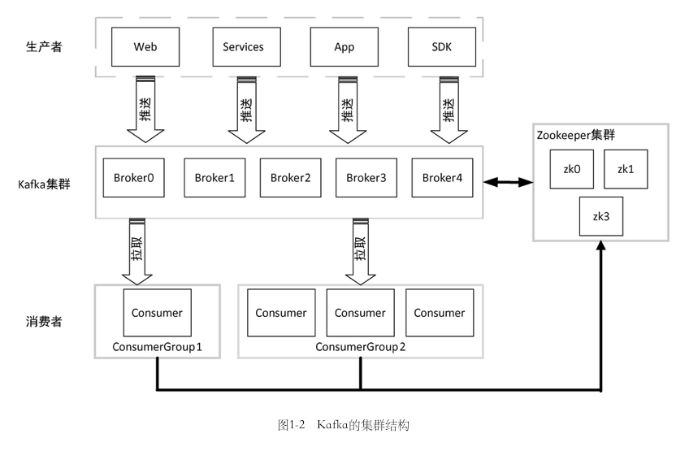
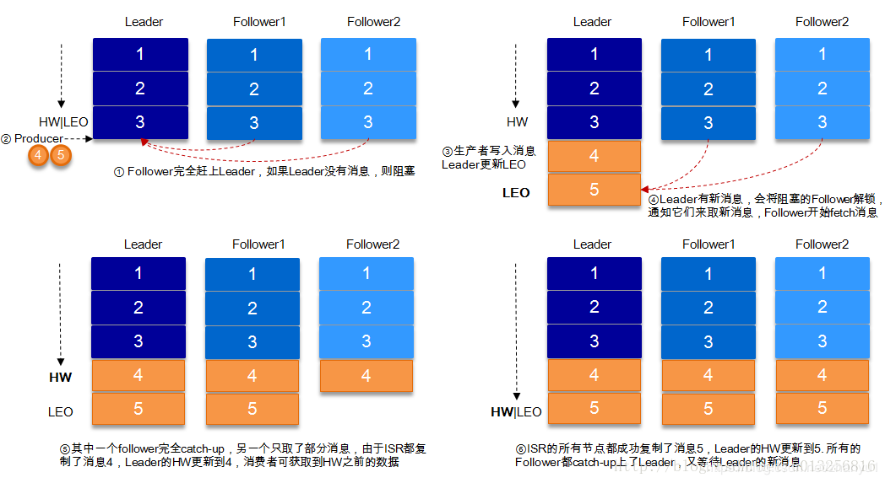
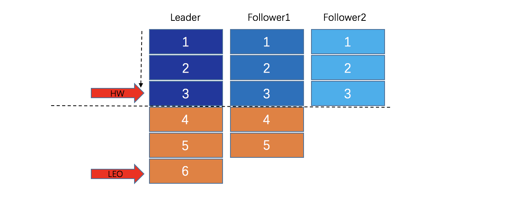

#Kafka

**ISR** In--Sync Replicas， 副本同步列表

**OSR** Outor-Sync Replicas

**AR** Assigned Replicas 

## 概述
>一个高吞吐量、分布式的发布-订阅消息系统。	

### 系统架构


### 特性
1. 消息持久化
2. 高吞吐量
3. 扩展性
4. 多客户端支持
5. Kafka Streams
6. 安全机制
7. 数据备份
8. 轻量级
9. 消息压缩

### 应用场景
1. 消息系统
2. 应用监控
3. 网站用户行为追踪
4. 流处理
5. 持久性日志
6. 限流削峰


### 高吞吐率实现
1. 顺序读写
2. 零拷贝
3. 批量发送
4. 消息压缩

### 安装

#### 单机
Download [kafka](http://kafka.apache.org/)	

Start zookeeper server

```bash
$ bin/zookeeper-server-start.sh config/zookeeper.properties
```

Start kafka server

```
$ bin/kafka-server-start.sh config/server.properties
```

Create a topic

```bash
#create a topic named "test" with a single partition and only one replica
 $ bin/kafka-topics.sh --create --zookeeper localhost:2181 --replication-factor 1 --partitions 1 --topic test                                         [14:44:32]
Created topic "test".
#查看创建的topic
 $ bin/kafka-topics.sh --list --zookeeper localhost:2181                                                                                              [14:44:34]
test
```

Send some messages

```bash
 $ bin/kafka-console-producer.sh --broker-list localhost:9092 --topic test                                                                            [14:44:51]
this is a message
this is another message
```

Start a consumer

```bash
 $ bin/kafka-console-consumer.sh --zookeeper localhost:2181 --topic test --from-beginning                                                             
this is a message
this is another message
```

#### 集群


## 工作原理与工作过程
### 基本原理

#### Topic

**主题（Topic）** Kafka 将一组消息抽象归纳为一个主题(Topic)， 也就是说，一个主题就是对消息的一个分类。	

> 一般情况下 一个topic的partition数量是broker的整数倍。

#### Partition

分区。 topic中的消息被分割为一个或者多个partition，其是一个物理概念，对应到系统上就是一个或若干个目录
> 每个分区在物理上对应为一个文件夹。分区的命名柜子为 [主题名称]-[分区编号]    
> 每个分区又有一至多个副本(Replica), 分区的副本分布在集群的不同代理上，以提高可用性


#### Segment

段。将partition进一步细分为了若干个segment，每个segment文件的大小相等。

#### Broker

Kafka集群包含一个或多个服务器，每个服务器节点称为一个broker

> N 个 partition， M个broker
>
> 若N>M, 且N是M的整数倍，每个broker会平均存储partition。
>
> 若N>M, 但N不是M的整数倍，此时会出现每个broker上分配的partition数量不一样的情况。尽量避免
>
> 若N<M, 则会出现有的broker中是没有分配partition的情况

#### Producer

生产者。即消息的发布者，其会将某topic的消息发布到相应的partition中

#### Consumer

消费者。可以从broker中读取消息，一个消费者可以消费多个topic的消息，但对于某一个topic的消息，其只会消费同一个partition中的消息

#### Replicas of partition

分区副本，副本是一个分区的备份，是为了防止消息丢失而创建的分区的备份

#### Partition Leader

每个partition有多个副本，其中有且仅有个作为Leader，Leader是当前负责消息读写的partition。即所有的读写操作只能发生与Leader分区上。

#### Partition Follower

所有Follower都需要从Leader同步消息，Follower与Leader始终保持消息同步。这些Follower都会保存在由Leader负责维护的ISR列表中

#### ISR 

Kafka在ZooKeeper中动态维护一个ISR(In-sync Replica)，即保存同步的副本列表，该列表中保存的是与Leader副本保持消息同步的所有副本对应的代理节点id。

#### Partition offset

分区偏移量。当consumer从partition中消费了若干消息后，consumer会将这些消费的消息中最大的offset提交给broker，表示当前partition已经消费到了该offset所标识的消息。

####Broker Controller

Kafka集群的多个broker中，有一个会被选举为controller。负责管理整个集群中partition和replicas的状态 

#### HW 与 LEO

HW, high Watermark ,高水位，表示Consumer可以消费到的最高partition偏移量。HW保证了Kafka集群中消息的一致性。

LEO， Log End Offset，日志最后消息的偏移量。消息在Kafka中是被写入到日志文件中，这是当前最后一个消息在Partition中的偏移量

对于Leader新写入的消息，Consumer是不能立刻消费的。leader会等待该消息被所有ISR中的partition follower同步后才会跟新HW，将HW卸乳到ISR中，此时消息才能被consumer消费



> 1. follower和leader数据一致，HW和LEO也一致，无需复制。
> 2. leader接收到producer写入的数据，此时LEO移动，两个follower开始复制数据。
> 3. follower1完全复制了消息，follower2只复制了一部分，HW移动一位。
> 4. follower2完全复制消息，HW和LEO一致。

#### Zookeeper

负责维护和协调broker。当然，ZK还负责Broker Controller的选举。

> Kafka 0.9开始offset的管理与保存机制发生了很大的变化，ZK中不再保存和管理offset了。

#### Consumer Group

consumer group 是kafka提供的可扩且具有容错性的消费者机制。组内可以有多个消费者，它们共享一个公共的ID，即group ID。组内的所有消费者协调在一起来消费订阅主题的所有分区。

kafka 保证同一个consumer group中只有一个consumer会消费某条消息，实际上kafka保证的是稳定状态下每一个consumer实例只会消费某一个或多个特定的数据只会被某一个特定的consumer实例所消费。

#### Coordinator

一般指的是运行在每一个broker上的group coordinator，用于管理consumer group中的各个成员，主要用于offset位移管理和rebalance，可以同时管理多个消费者组

#### Rebalance

当消费者组中消费才数量发生变化，或Topic中的partition数量发生了变化时，partition的所有权会在消费者间转移，即partition会重新分配，这个过程称为再均衡Rebalance

- 消费者组中新增消费者
- 消费者关闭或宕机或取消订阅
- Topic 新增/删除partition

#### Offset Commit

consumer在消费过消息后需要将其消费的消息的offset提交给broker，以让broker记录下那些消息是消费过的。记录已消费过的offset值有什么用呢？除了用于表示那些消息将来要被删除外，还有一个很重要的作用：在发生再均衡时不会引发消息的丢失或重复消费。

### 工作原理与过程

#### 消息路由

消息要写入到那个Partition并不是随机的，而是有路由策略的。

1. 若指定了partition则直接写入指定的partition；
2. 若未制定partition但指定了key，则通过对key的hash值与partition数量取模，改取模结果就是要选出的partition索引；Record key-value
3. 若partition和key都未指定，则使用轮询算法选出一个partition。

#### 消息写入算法

消息发送者将消息发送给broker，并形成最终的可供消费者消费的log。

1. producer先从zookeeper中找到改partition的leader
2. producer将消息发送给该leader
3. leader将消息写入本地log
4. ISR中的followers从leader中pull消息，写入本地log后向leader发送ACK
5. leader收到所有的ISR中的followers的ACK后，增加HW并向producer发送ACK

#### HW截断机制

如果partition leader接收到了新的消息，其他ISR中Follower正在同步过程中，还未同步完毕时leader宕机。此时就需要选举出新的leader。若没有HW截断机制，将会导致partition中offset数据的不一致。为了避免这种情况发生，引入了HW的截断机制。



>如果 Leader 宕机，Follower1 被选为新的 Leader，而新的 Leader（原 Follower1 ）并没有完全同步之前 Leader 的所有数据（少了一个消息 6），之后，新 Leader 又继续接受了新的数据，此时，原本宕机的 Leader 经修复后重新上线，它将发现新 Leader 中的数据和自己持有的数据不一致，怎么办呢？
>
>为了保证一致性，必须有一方妥协，显然旧的 Leader 优先级较低，因此， 它会将自己的数据截断到宕机之前的 HW 位置（HW 之前的数据，与 Leader 一定是相同的），然后同步新 Leader 的数据。这便是所谓的 “截断机制”。

#### 消息发送的可靠机制

生产者向Kafka发送消息时，可以选择需要的可靠级别。通过`request.required.acks`参数的值进行设置

* 0 异步发送。生产者向kafka发送消息而不需要kafka反馈成功ACK

  > 丢失消息的原因
  >
  > * kafka根本没有收到消息
  > * kafka的buffer满了，要想partition写入消息，在还未写入的瞬间，生产者又生产了新的消息并发送了过来，那么，这小消息就丢失了
  > * 消息的生产顺序与写入到kafka中的顺序不一致

* 1 同步发送。生产者发送消息给kafka，broker的partition leader在收到消息后马上发送成功ack（无需等待ISR中的follower同步），生产者收到后知道消息发送成功，然后会在发送消息。如果一直未收到kafka的ack，则认为消息发送失败，会自动重发消息

* -1 同步发送。生产者发送消息给kafka，kafka收到消息后要等到ISR列表中的所有副本都同步消息完成后，才向生产者发送成功ACK。如果一直未收到kafka的ack，则认为消息发送失败，会自动重发消息。

  > 存在消息重复接收的问题。

  kafka 引入了唯一标识与去重机制。

#### 消费者消费过程解析

生产者将消息发送到topic中，消费者即可对其进行消费，其消费过程如下：

* 消费者订阅指定topic的消息
* broker controller会为消费者分配partition，并将该partition的当前offset发送给消费者
* 当broker接收到生产者发送的消息时，broker会想消息推送给消费者
* 消费者接受broker推送的消息后对消息进行消费
* 当消费者消费完该条消息后，消费者会向broker发送一个该消息已被消费的反馈
* 当broker接到消费者反馈后，broker会更新partition中的offset
* 以上过程一直重复，直到消费者停止请求消息
* 消费者可以重置offset，从而可以灵活消费存储在broker上的消息

#### Partition Leader选举范围

当leader宕机后broker controller会从ISR中选一个follower成为新的leader。但，若ISR中所有副本都宕机怎么不办？可以通过`unclean.leader.election.enable`的值来设置leader选举的范围。

* fasle 必须等待ISR列表中所有副本活过来才进行新的选举。该策略可靠性有保证，但可用性低。
* true 可以选择任何一个没有宕机的follower，但该follower可能不在ISR中

#### 重复消费问题及解决方案

最常见的重复消费有两种：

1. 同一个consumer重复消费
2. 不同的consumer重复消费

解决方案

1. 增加绘画超时时限`session.timeout.ms`的值，延长offset提交时间；
2. 设置`enable.auto.commit`为fasle，将kafka自动提交offset改为手动提交。

### 日志查看

#### 查看段segment

##### segment 文件名

segment是一个逻辑概念，其由两类物理文件组成，分别为`.index`文件和`.log`文件。`.log`文件中存放的是消息，而`.index`文件中存放的是`.log`文件中消息的索引。

这两个文件的文件名水成对出现的，即会出现相同文件名的log与index文件名。文件名由20位数字字符组成，其要表示一个64位长度的数值（2的64次方是一个长度为20的数字）。作为文件名，其数值长度不足20位的全部用0填补。

##### segment文件内容

##### 消息的查找

##### 查看segment


## API


## Java 集成

### 错误解决

#### java.lang.IllegalArgumentException: The class 'com.dc.bill.dto.apiModel.ApiParamModel' is not in the trusted packages: [java.util, java.lang]. If you believe this class is safe to deserialize, please provide its name. If the serialization is only done by a trusted source, you can also enable trust all (*).

```yaml
spring:
  kafka:
    bootstrap-servers: localhost:9092
    producer:   # 配置生产者
      key-serializer: org.apache.kafka.common.serialization.StringSerializer
      value-serializer: org.springframework.kafka.support.serializer.JsonSerializer

    consumer:   # 配置消费者
      group-id: group0  # 消费者组
      key-deserializer: org.apache.kafka.common.serialization.StringDeserializer
      value-deserializer: org.springframework.kafka.support.serializer.JsonDeserializer
      enable-auto-commit: false
      properties:
        spring:
          json:
            trusted:
              packages: com.dc.bill.dto.apiModel			# 相信包
    listener:
      ack-mode: manual		# 手动ack
```


