## Install

### Linux


### macos
brew 安装nginx
```
brew tap homebrew/nginx  # 拉取nginx
brew install nginx-full --with-rtmp-module  # 安装 rtmp 模块, 看情况添加
brew info nginx-full #打印信息
```

### 查看 nginx 安装信息

`nginx -V`

nginx配置文件的位置：

```
nginx -s 重新加载配置|重启|停止|退出
nginx -s reload|reopen|stop|quit

nginx -V 查看版本，以及配置文件地址
nginx -v 查看版本
nginx -c filename 指定配置文件
nginx -h 帮助
nginx -t 测试配置是否有语法错误
```


## 配置

```bash
#user  nobody;
# worker角色的工作进程的个数，master进程是接收并分配请求给worker处理。这个数值简单一点可以设置为cpu的核数grep ^processor /proc/cpuinfo | wc -l，也是 auto 值，如果开启了ssl和gzip更应该设置成与逻辑CPU数量一样甚至为2倍，可以减少I/O操作。如果nginx服务器还有其它服务，可以考虑适当减少。
worker_processes  1;

events {
    worker_connections  1024;
}

http {
    include       mime.types;
    default_type  application/octet-stream;
    sendfile        on;
    #keepalive_timeout  0;
    keepalive_timeout  65;

    #gzip  on;

    server {
        listen       8080;
        server_name  localhost;
        #charset koi8-r;
        #access_log  logs/host.access.log  main;

        location / {
            root   html;
            index  index.html index.htm;
        }

        #error_page  404              /404.html;

        # redirect server error pages to the static page /50x.html
        #
        error_page   500 502 503 504  /50x.html;
        location = /50x.html {
            root   html;
        }

        # proxy the PHP scripts to Apache listening on 127.0.0.1:80
        location ~ /jg {
			
        }  
    }
    include servers/*;
}
```


### 测试 rtmp 推流

`ffmpeg -f avfoundation -framerate 30 -i "0" -c:v libx264 -an -f flv rtmp://localhost/live/hello`


## 基本概念

### 应用场景

* 静态资源服务
* 反向代理
  * Nginx 强大的性能
  * 缓存
  * 负载均衡
* API服务 OpenRestry

### 优点

1. 高并发，高性能

2. 可扩展性好

3. 高可可靠性

4. 热部署
5. BSD许可证

### 主要组成部分

1. Nginx 二进制可执行文件
2. Nginx.conf 配置文件
3. access.log 访问日志
4. error.log 错误日志

### 编译


### 配置文件的通用语法介绍

* 配置文件由指令与指令块构成
* 每条指令已`;`结尾，指令与参数之间已空格分隔
* 指令块已`{}`大括号讲多条指令组织在一起
* `include`语句允许组合多个配置文件以提升可维护性
* 使用`#`符号添加注释，提高可读性
* 使用`$`符号使用变量
* 部分指令的参数支持正则表达式


#### 配置参数

##### 时间单位

* `ms` milliseconds
* `s` seconds
* `m` minutes
* `h` hours
* `d` days
* `w` weeks
* `M` mmonths
* `y` years

##### 空间单位

* `空`  bytes
* `k/K` kilobytes
* `m/M` megabytes
* `g/G` gigabytes

##### http配置指令块

* http
* server
* location
* upstream

### 命令演示

* 格式 `nginx -s reload`
* `-? -h` 帮助
* `-c` 使用指定的配置文件
* `-g` 指定配置指令
* `-p` 指定允许目录
* `-s` 发送信号， `stop、quit、reload、reopen`
* `-t -T` 测试配置文件是否有语法错误
* `-v -V` 打印nginx的版本信息、编译信息

#### 热部署

```bash
cp nginx nginx.old   # 备份当前运行的nginx
cp -r new/nginx runtime/nginx -f   # 用新的nginx 覆盖当前运行的nginx
# 发送 USR2 信号给旧版本主进程号,使 nginx 的旧版本停止接收请求，用 nginx 新版本接替
kill -USR2 old.nginx.work.pid 
# 发送 WINCH 信号到旧的主进程，它会通知旧的 worker 进程优雅的关闭，然后退出
kill -WINCH old.nginx.work.pid
# 发送 QUIT 信号到旧的主进程，它会退出保留的 master 进程
kill -QUIT old.nginx.work.pid
```

#### 日志切割

```bash
mv access.log access.bak.log  # 备份原日志
nginx -s reopen    # 切割日志
```

 ##### 定时日志切割脚本

```bash
#!/bin/bash
LOGS_PATH=/usr/local/nginx/logs/history
CUR_LOGS_PATH=/usr/local/nginx/logs
YESTERDAY=$(date -d "yesterday" +%Y-%m-%d)
mv ${CUR_LOGS_PATH}/access.log ${LOGS_PATH}/old_access_${YESTERDAY}.log
mv ${CUR_LOGS_PATH}/error.log ${LOGS_PATH}/old_error_${YESTERDAY}.log
## 向 NGINX 主进程发送 USR1 信号。USR1 信号是重新打开日志文件
kill -USR1 $(cat /usr/local/nginx/logs/nginx.pid)
```

### 反向代理

```bash
http{
	proxy_cache_path /tmp/nginxcache levels=1:2 keys_zone=my_cache;10m max_size=10g inactive=50m use_temp_path=off;

	upstream local {
		server 127.0.0.1:8080;
	}
	
	server {
		listen 80;
		
		location / {
			proxy_set_header Host $host;
			proxy_set_header X-Real-IP $remote_addr;
			proxy_set_header X-Forwarded-For $proxy_add_x_forwarded_for;
			
			# 缓存
			proxy_cache my_cache;
			proxy_cache_key $host$uri$is_args$args;
			proxy_cache_valid 200 304 302 1d;
			proxy_pass http://local;
		}
	}
}
```

#### 附录

http://nginx.org/en/docs/http/ngx_http_proxy_module.html

### GoAccess实现可视化并实时监控access日志

```bash
goaccess access.log -o /var/www/html/report.html --log-format=COMBINED --real-time-html
```

#### 附录

https://goaccess.io/get-started

### TLS/SSL

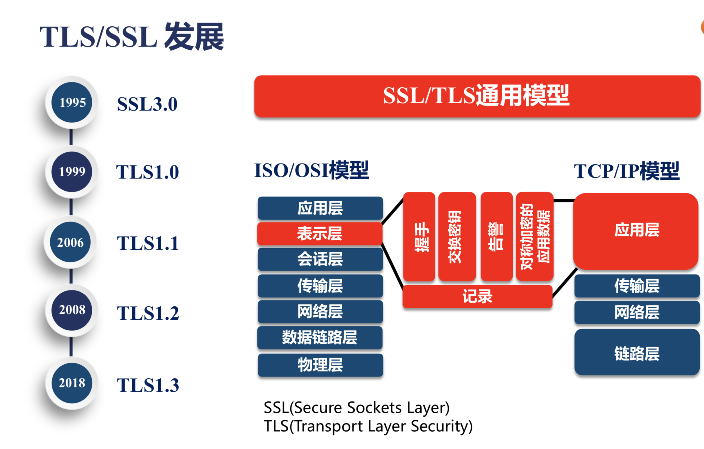


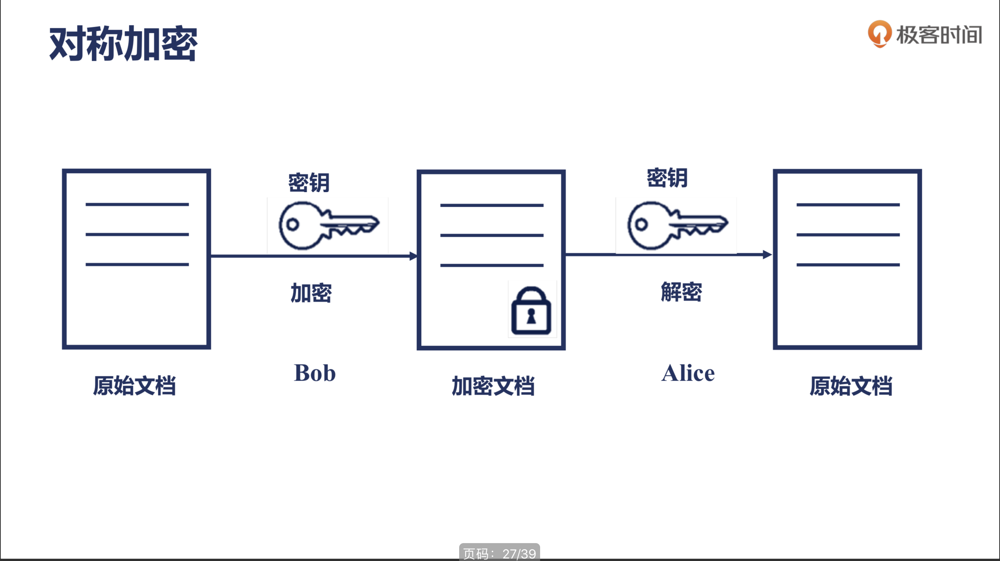


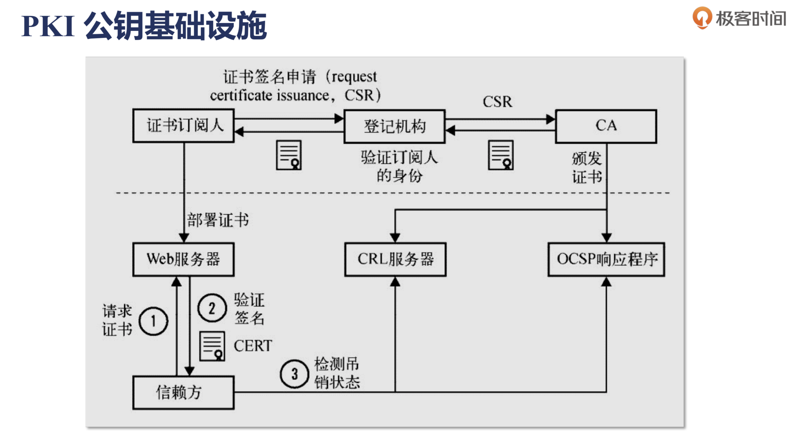

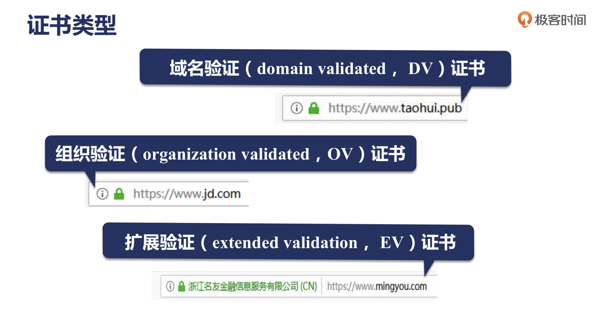

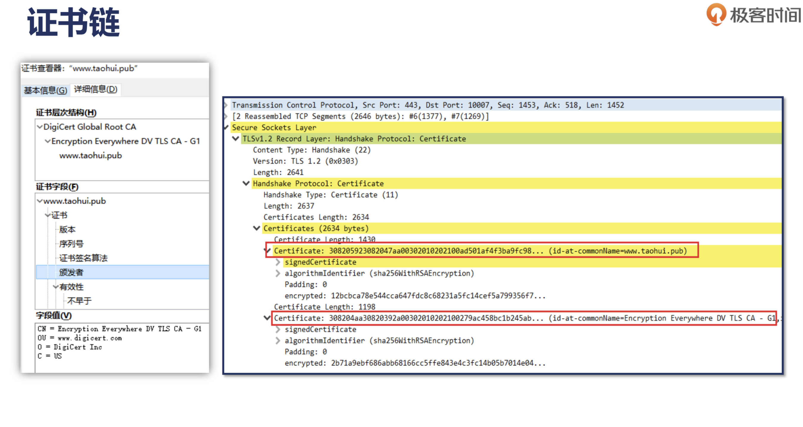

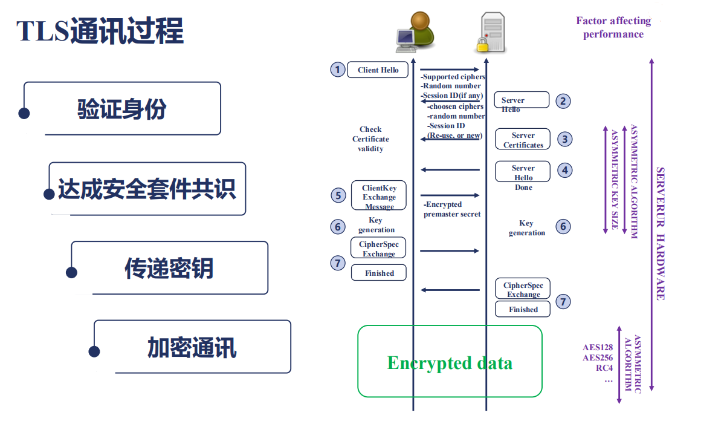

 **通讯过程中，双方主要想完成4个目的：**

- 1、验证身份
- 2、达成安全套件共识
- 3、传递密钥
- 4、加密通讯

  **整个通讯过程注释：**

- 1、第一步中由浏览器向服务器发送了一个 Client Hello 消息。这一步主要是因为浏览器是多样化的、版本也在不停的变更，所以不同的浏览器支持的安全套件、加密算法都是不同的。所以在第一步 Client Hello 浏览器告诉服务器我支持哪些算法。
- 2、第二步 Server Hello中，Nginx 有自己能够支持的加密算法列表以及倾向于使用哪个加密算法套件。那么在这一步 Nginx 会选择一套他自己最喜欢的加密套件发送给客户端。如果想要复用 session ，也就是说 Nginx 打开了 session cache，希望在一天内断开链接的客户端不用再次协商密钥，那么在这一步可以直接复用之前的密钥。所以 Server Hello 信息中主要会发送究竟选择哪一个安全套件。
- 3、第三步中 Nginx 会把自己的公钥证书发送给浏览器，这个公钥证书中是包含证书链的，所以浏览器可以找到自己的根证书库，去验证证书是否是有效的。
- 4、第四步服务器会发送 Server Hello Done ，但是如果我们之前协商的安全套件，比如提到的椭圆曲线算法，这时候需要在第三步和第四步之间去把椭圆曲线的参数发送给客户端，方便在第六步生成最终进行加密的密钥。
- 5、第五步的时候客户端也需要根据椭圆曲线的公共参数生成自己的私钥，再把公钥发送给服务器。
- 6、那么这样，服务器有了自己的私钥、把公钥发送给客户端，可以根据自己的私钥和客户端的公钥共同生成双方加密的密钥，也就是第六步。这一步是服务器独自做的，而客户端根据服务器发来的公钥和自己生成的私钥也可以生成一个密钥，而服务器和客户端各自生成的密钥是相同的，这个是由非对称加密算法来保证的（也就是之前说的 DHCE 算法）。
- 7、加下来就可以用第六步生成的密钥进行数据加密，进行通讯。

  **从这个过程中可以看到，TLS通讯主要是在做两件事情，第一个是交换密钥、第二个是加密数据，所以最消耗性能的地方也是这两点。**


#### 附录

[通过 Certbot 安装 Let's Encrypt 证书](https://certbot.eff.org/)

### OpenResty用Lua语言实现简单服务


## Nginx 架构基础

### Nginx的请求处理流程

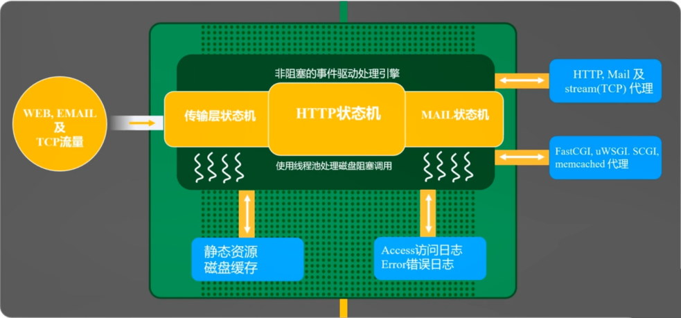

1. nginx可以处理来自web（http），Email，TCP/UDP的三类请求。
2. nginx底层使用非阻塞的事件驱动引擎，结合状态机来完成异步通知，其中处理Http请求的是HTTP状态机。

### Nginx进程结构

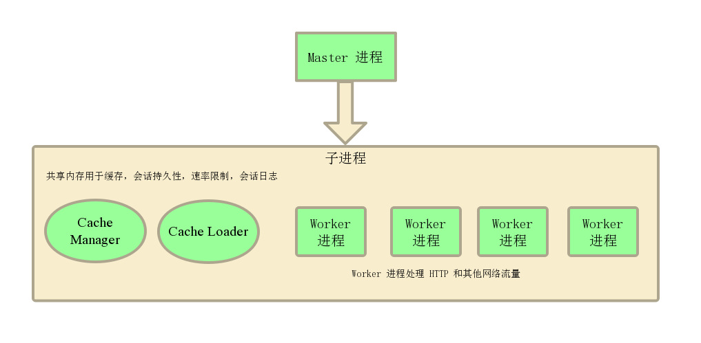

#### 为什么 Nginx 采用多进程结构而不是多线程结构呢？

因为 Nginx 最核心的一个目的是要保持高可用性、高可靠性，而当 Nginx 如果使用的是多线程结构的时候，因为线程之间是共享同一个地址空间的，所以当某一个第三方模块引发了一个地址空间导致的段错误时、在地址越界出现时，会导致整个 Nginx 进程全部挂掉。而当采用多进程模型时，往往不会出现这样的问题。从上图可以看到 Nginx 在做进程设计时，同样遵循了实现高可用、高可靠这样的一个目的。


### 使用信号管理Nginx父子进程

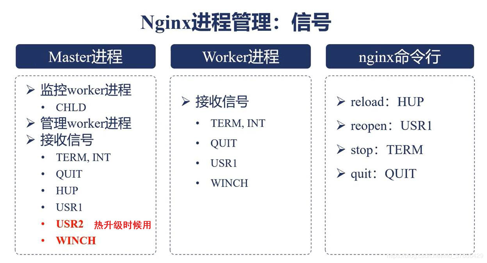

### reload流程

1.向master进程发送HUP信号（reload）

2.maseer 进程校验配置语法是否正确

3.master进程打开新监听的端口

4.master进程用新配置启动worker子进程

5.master进程向老worker子进程发送quit信号

6.老worker进程关闭监听句柄，并处理完当前连接后退出结束进程

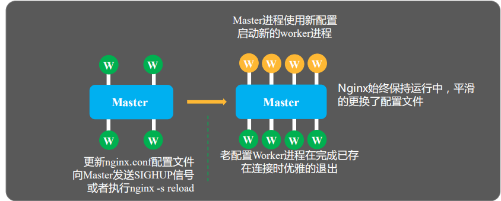

### 热升级完整流程

1.将就的nginx文件缓存新的nginx文件。注意备份，及编译新版本nginx指定的路径要与就版本中一致

2.向master进程发送USR2信号

3.master进程会自己修改PID文件名，加后缀.oldbin

4.master进程用新的NGINX文件启动新的master进程

5.向老master进程发送quit信号，关闭老master进程；但老的master进程会保存下来

6.回滚：向老的master发送HUP，向新master发送QUIT信号

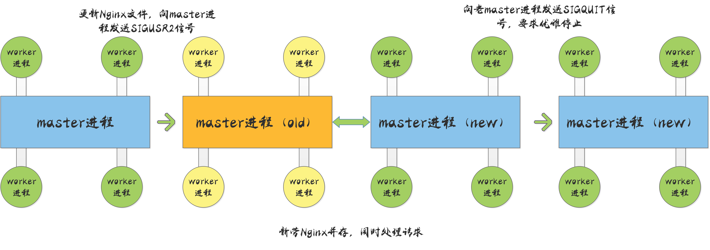

> Linux知识点： 一个父进程退出，而它的一个或多个子进程还在运行，那么哪些子进程将成为孤儿进程。孤儿进程将被init进程（进程号为1）所收养，并由init进程对他们完成状态收集工作。所以老master退出后，新的master并不会退出。

### 优雅地关闭worker进程

1. 在 nginx.conf 中可以配置一个 `worker_shutdown_timeout`，配置完 `worker_shutdown_timeout` 之后，会加一个标志位。表示进入优雅关闭流程了。
2. 第二步会**先关闭监听句柄**，要保证所在的worker进程不会再去处理新的链接。

3. 接下来会先去看连接池（因为 Nginx 为了保证对资源的利用是最大化的，经常会保存一些空闲的链接，但是没有断开），首先关闭空闲链接

4. 第四步是可能非常**耗时**的一步。因为 Nginx 不是主动的立刻关闭，是通过第一步添加的标志位，然后在循环中每当发现一个请求处理完毕，就会把这个请求使用的链接关掉，所以在循环中等待关闭所有的时间可能会很长。 当设置了 `worker_shutdown_timeout` 的时候，即使请求还没处理完，当时间到了之后这些请求都会被强制关闭。{总结两点：①、当请求都处理完毕，会退出进程；②、当超时时间到了，会退出进程}


> 针对HTTP，TCP，UDP无法判断包是否完成


### 网络收发与Nginx事件间的对应关系

#### 网络传输

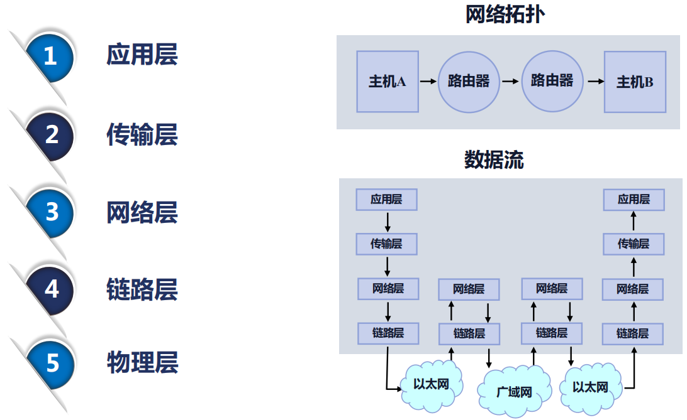

 **应用层**里发送了一个 get请求 -》 到了**传输层**（这一步主要在做一件事，就是浏览器打开了一个端口，在 windows的任务管理器中可以看到这一点，他会把这个端口记下来以及把 Nginx 打开的端口比如80或者443也记到传输层） -》 然后在**网络层**会记下我们主机所在的IP和目标主机（就是Nginx）所在服务器公网IP -》 到**链路层**以后 -》 经过**以太网** -》 到达家里的路由器{**链路层**} -》 家中的路由器会记录下所在运营商的一些下一段的IP{**网络层**} -》 通过**广域网** -》 跳转到主机B所在的机器中 -》 报文会经过**链路层** -》 **网络层** -》 到**传输层**，在传输层操作系统就知道是给那个打来了80或者443的进程，这个进程自然就是Nginx -》 那么 Nginx 在他的HTTP状态处理机里面{**应用层**}就会处理这个请求。

#### TCP流与报文


**数据链路层**会在数据的前面 Header 部分和 Footer部分 添加源MAC地址和源目的地址

到了**网络层**则是 Nginx 的公网地址（目的IP地址）和浏览器的公网地址（源IP地址）

到了**TCP层（传输层）**，指定了 Nginx 打开的端口（目的端口）和浏览器打开的端口（源端口）

然后**应用层**就是HTTP协议了

这就是一个报文。也就是说我们发送的HTTP协议会被切割成很多小的报文，在网络层会切割叫MTU，以太网的每个MTU是1500字节；在**TCP层（传输层）**呢会考虑中间每个环节中最大的一个MTU值，这个时候往往每个报文只有几百字节，这个报文大小我们称为叫 MSS ，所以每收到一个 MSS 小于这么大小的一个报文时其实就是一个网络事件。

#### TCP协议与非阻塞接口

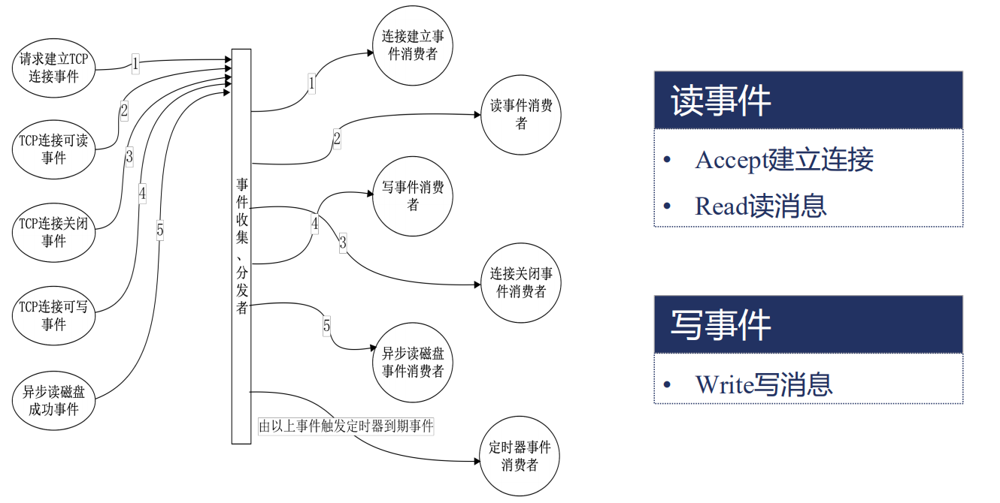

 **TCP协议中许多事件是怎样和我们日常调用的一些接口（比如Accept、Read、Write、Close）是怎样关联在一起的？**

1. 请求建立TCP连接事件 实际上是发送了一个TCP报文，通过上面第二部分讲解的那样的一个流程到达了 Nginx，对应的是读事件。因为对于Nginx来说，我读取到了一个报文，所以就是 Accept建立链接事件。

2. 如果是TCP连接可读事件，就是发送了一个消息，对于Nginx也是一个读事件，就是 Read读消息

3. 如果是对端（也就是浏览器），主动的关掉了，相当于windows操作系统会去发送一个要求关闭链接的一个事件，对于nginx来说还是一个读事件，因为他只是去读取一个报文。

4. 那什么是写事件呢？当我们的浏览器需要向浏览器发送响应的时候，需要把消息写到操作系统中，要求操作系统发送到网络中，这就是一个写事件。

5. 像这样的一些网络读写事件，通常在 Nginx 中或者任何一个异步事件的处理框架中，他会有个东西叫事件收集、分发器。会定义每类事件处理的消费者，也就是说事件是一个生产者，是通过网络中自动的生产到我们的Nginx中的，我们要对每种事件建立一个消费者。比如连接建立事件消费者，就是对Accept调用，http模块就会去建立一个新的链接。还有很多读消息或者写消息，在http状态机中不同的时间段会调用不同的方法也就是每个消费者处理。以上就是一个事件分发、消费器，包括AIO像异步读写磁盘事件，还有定时器事件、比如（worker_shutdown_timeout）是否超时。

### Nginx的事件驱动模型

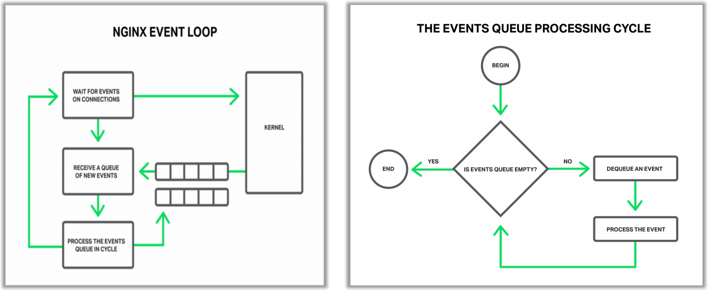

1. 当 Nginx 刚刚启动时，在 WAIT FOR EVENTS ON CONNECTIONS部分，也就是打开了 80 或 443 端口。这个时候在等待新的事件进来，比如新的客户端连上了nginx向我们发起了链接，在等这样的事件。此步往往对应 epoll的epoll wait 方法，这个时候的Nginx其实是处于 sleep 这样一个进程状态的。当操作系统收到了一个建立TCP链接的握手报文时并且处理完握手流程以后，操作系统就会通知 epoll wait 这个阻塞方法，告诉它可以往下走了，同时唤醒 Nginx worker进程

2. 往下走完之后，会去找操作系统要事件（上图的 KERNEL 就是操作系统内核）。操作系统会把他准备好的事件，放在事件队列中。从这个事件队列中（RECEIVE A QUEUE OF NEW EVENTS）可以获取到需要处理的事件。比如建立链接、比如收到一个TCP请求报文。

3. 取出以后就会处理这么一个事件（PROCESS THE EVENTS QUEUE IN CYCLE）。上图的最右面就是处理事件的一个循环：当发现队列中不为空，就把事件取出来（DEQUEUE AN EVENT） 开始处理（PROCESS THE EVENT）；在处理事件的过程中，可能又生成新的事件，比如说发现一个链接新建立了，可能要添加一个超时时间，比如默认的60秒，也就是说60秒之内如果浏览器不向我发送请求的话我就会把这个链接关掉；又比如说当我发现已经收完了完整的HTTP请求以后，可以生成HTTP响应了，那么这个生成响应呢是需要我可以向操作系统的写缓存中心里面去把响应写进去，要求操作系统尽快的把这样一段响应内容发到浏览器上（也就是说可能在处理过程中可能会产生新的事件，就是PROCESS THE EVENTS QUEUE IN CYCLE部分 指向的队列部分，等待下一次来处理）。

4. 如果所有的事件都处理完成以后呢，又会返回到 WAIT FOR EVENTS ON CONNECTIONS部分。


### epoll的优劣及原理


## 详解HTTP模块

## 反向代理与负载均衡

## Nginx的系统层性能优化

##  Nginx 与 OpenResty

