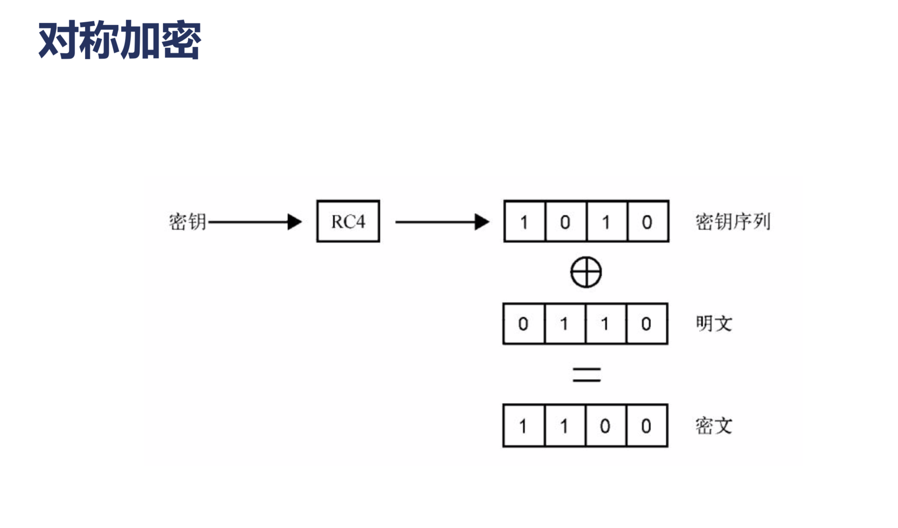
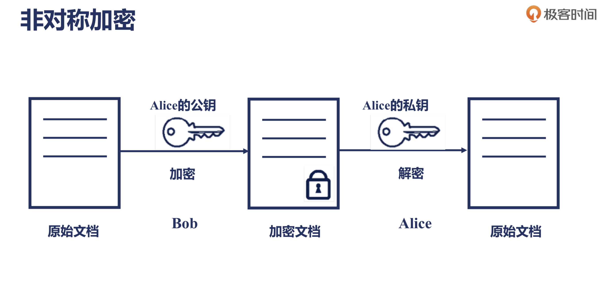

## Install

### Linux


### macos
brew 安装nginx
```
brew tap homebrew/nginx  # 拉取nginx
brew install nginx-full --with-rtmp-module  # 安装 rtmp 模块, 看情况添加
brew info nginx-full #打印信息
```

### 查看 nginx 安装信息

`nginx -V`

nginx配置文件的位置：

```
nginx -s 重新加载配置|重启|停止|退出
nginx -s reload|reopen|stop|quit

nginx -V 查看版本，以及配置文件地址
nginx -v 查看版本
nginx -c filename 指定配置文件
nginx -h 帮助
nginx -t 测试配置是否有语法错误
```


## 配置

```bash
#user  nobody;
# worker角色的工作进程的个数，master进程是接收并分配请求给worker处理。这个数值简单一点可以设置为cpu的核数grep ^processor /proc/cpuinfo | wc -l，也是 auto 值，如果开启了ssl和gzip更应该设置成与逻辑CPU数量一样甚至为2倍，可以减少I/O操作。如果nginx服务器还有其它服务，可以考虑适当减少。
worker_processes  1;

events {
    worker_connections  1024;
}

http {
    include       mime.types;
    default_type  application/octet-stream;
    sendfile        on;
    #keepalive_timeout  0;
    keepalive_timeout  65;

    #gzip  on;

    server {
        listen       8080;
        server_name  localhost;
        #charset koi8-r;
        #access_log  logs/host.access.log  main;

        location / {
            root   html;
            index  index.html index.htm;
        }

        #error_page  404              /404.html;

        # redirect server error pages to the static page /50x.html
        #
        error_page   500 502 503 504  /50x.html;
        location = /50x.html {
            root   html;
        }

        # proxy the PHP scripts to Apache listening on 127.0.0.1:80
        location ~ /jg {
			
        }  
    }
    include servers/*;
}
```


### 测试 rtmp 推流

`ffmpeg -f avfoundation -framerate 30 -i "0" -c:v libx264 -an -f flv rtmp://localhost/live/hello`


## 基本概念

### 应用场景

* 静态资源服务
* 反向代理
  * Nginx 强大的性能
  * 缓存
  * 负载均衡
* API服务 OpenRestry

### 优点

1. 高并发，高性能

2. 可扩展性好

3. 高可可靠性

4. 热部署
5. BSD许可证

### 主要组成部分

1. Nginx 二进制可执行文件
2. Nginx.conf 配置文件
3. access.log 访问日志
4. error.log 错误日志

### 编译


### 配置文件的通用语法介绍

* 配置文件由指令与指令块构成
* 每条指令已`;`结尾，指令与参数之间已空格分隔
* 指令块已`{}`大括号讲多条指令组织在一起
* `include`语句允许组合多个配置文件以提升可维护性
* 使用`#`符号添加注释，提高可读性
* 使用`$`符号使用变量
* 部分指令的参数支持正则表达式


#### 配置参数

##### 时间单位

* `ms` milliseconds
* `s` seconds
* `m` minutes
* `h` hours
* `d` days
* `w` weeks
* `M` mmonths
* `y` years

##### 空间单位

* `空`  bytes
* `k/K` kilobytes
* `m/M` megabytes
* `g/G` gigabytes

##### http配置指令块

* http
* server
* location
* upstream

### 命令演示

* 格式 `nginx -s reload`
* `-? -h` 帮助
* `-c` 使用指定的配置文件
* `-g` 指定配置指令
* `-p` 指定允许目录
* `-s` 发送信号， `stop、quit、reload、reopen`
* `-t -T` 测试配置文件是否有语法错误
* `-v -V` 打印nginx的版本信息、编译信息

#### 热部署

```bash
cp nginx nginx.old   # 备份当前运行的nginx
cp -r new/nginx runtime/nginx -f   # 用新的nginx 覆盖当前运行的nginx
# 发送 USR2 信号给旧版本主进程号,使 nginx 的旧版本停止接收请求，用 nginx 新版本接替
kill -USR2 old.nginx.work.pid 
# 发送 WINCH 信号到旧的主进程，它会通知旧的 worker 进程优雅的关闭，然后退出
kill -WINCH old.nginx.work.pid
# 发送 QUIT 信号到旧的主进程，它会退出保留的 master 进程
kill -QUIT old.nginx.work.pid
```

#### 日志切割

```bash
mv access.log access.bak.log  # 备份原日志
nginx -s reopen    # 切割日志
```

 ##### 定时日志切割脚本

```bash
#!/bin/bash
LOGS_PATH=/usr/local/nginx/logs/history
CUR_LOGS_PATH=/usr/local/nginx/logs
YESTERDAY=$(date -d "yesterday" +%Y-%m-%d)
mv ${CUR_LOGS_PATH}/access.log ${LOGS_PATH}/old_access_${YESTERDAY}.log
mv ${CUR_LOGS_PATH}/error.log ${LOGS_PATH}/old_error_${YESTERDAY}.log
## 向 NGINX 主进程发送 USR1 信号。USR1 信号是重新打开日志文件
kill -USR1 $(cat /usr/local/nginx/logs/nginx.pid)
```

### 反向代理

```bash
http{
	proxy_cache_path /tmp/nginxcache levels=1:2 keys_zone=my_cache;10m max_size=10g inactive=50m use_temp_path=off;

	upstream local {
		server 127.0.0.1:8080;
	}
	
	server {
		listen 80;
		
		location / {
			proxy_set_header Host $host;
			proxy_set_header X-Real-IP $remote_addr;
			proxy_set_header X-Forwarded-For $proxy_add_x_forwarded_for;
			
			# 缓存
			proxy_cache my_cache;
			proxy_cache_key $host$uri$is_args$args;
			proxy_cache_valid 200 304 302 1d;
			proxy_pass http://local;
		}
	}
}
```

#### 附录

http://nginx.org/en/docs/http/ngx_http_proxy_module.html

### GoAccess实现可视化并实时监控access日志

```bash
goaccess access.log -o /var/www/html/report.html --log-format=COMBINED --real-time-html
```

#### 附录

https://goaccess.io/get-started

### TLS/SSL







 **通讯过程中，双方主要想完成4个目的：**

- 1、验证身份
- 2、达成安全套件共识
- 3、传递密钥
- 4、加密通讯

  **整个通讯过程注释：**

- 1、第一步中由浏览器向服务器发送了一个 Client Hello 消息。这一步主要是因为浏览器是多样化的、版本也在不停的变更，所以不同的浏览器支持的安全套件、加密算法都是不同的。所以在第一步 Client Hello 浏览器告诉服务器我支持哪些算法。
- 2、第二步 Server Hello中，Nginx 有自己能够支持的加密算法列表以及倾向于使用哪个加密算法套件。那么在这一步 Nginx 会选择一套他自己最喜欢的加密套件发送给客户端。如果想要复用 session ，也就是说 Nginx 打开了 session cache，希望在一天内断开链接的客户端不用再次协商密钥，那么在这一步可以直接复用之前的密钥。所以 Server Hello 信息中主要会发送究竟选择哪一个安全套件。
- 3、第三步中 Nginx 会把自己的公钥证书发送给浏览器，这个公钥证书中是包含证书链的，所以浏览器可以找到自己的根证书库，去验证证书是否是有效的。
- 4、第四步服务器会发送 Server Hello Done ，但是如果我们之前协商的安全套件，比如提到的椭圆曲线算法，这时候需要在第三步和第四步之间去把椭圆曲线的参数发送给客户端，方便在第六步生成最终进行加密的密钥。
- 5、第五步的时候客户端也需要根据椭圆曲线的公共参数生成自己的私钥，再把公钥发送给服务器。
- 6、那么这样，服务器有了自己的私钥、把公钥发送给客户端，可以根据自己的私钥和客户端的公钥共同生成双方加密的密钥，也就是第六步。这一步是服务器独自做的，而客户端根据服务器发来的公钥和自己生成的私钥也可以生成一个密钥，而服务器和客户端各自生成的密钥是相同的，这个是由非对称加密算法来保证的（也就是之前说的 DHCE 算法）。
- 7、加下来就可以用第六步生成的密钥进行数据加密，进行通讯。

  **从这个过程中可以看到，TLS通讯主要是在做两件事情，第一个是交换密钥、第二个是加密数据，所以最消耗性能的地方也是这两点。**


#### 附录

[通过 Certbot 安装 Let's Encrypt 证书](https://certbot.eff.org/)

### OpenResty用Lua语言实现简单服务


## Nginx 架构基础

## 详解HTTP模块

## 反向代理与负载均衡

## Nginx的系统层性能优化

##  Nginx 与 OpenResty

