## 简介


## 安装

### osx
```bash
brew install redis
brew services start redis
redis-cli 							#进去cli客户端
```
### Centos 
```bash
wget http://download.redis.io/releases/redis-5.0.2.tar.gz
tar zxf redis-5.0.2.tar.gz
make PREFIX=/usr/local/redis install
# 建立软连接
ln -s /usr/local/redis/bin/redis-cli /usr/local/bin/redis-cli   
```

解决错误

```bash
make
cd src && make all
make[1]: Entering directory `/usr/local/redis-5.0.2/src'
    CC adlist.o
In file included from adlist.c:34:0:
zmalloc.h:50:31: fatal error: jemalloc/jemalloc.h: No such file or directory
 #include <jemalloc/jemalloc.h>
                               ^
compilation terminated.
make[1]: *** [adlist.o] Error 1
make[1]: Leaving directory `/usr/local/redis-5.0-rc3/src'
make: *** [all] Error 2
```

最后解决方案如下：
```bash
cd deps
make hiredis lua jemalloc linenoise
```

### redis.conf

```bash
# 开启密码验证
requirepass 123456  
# 守护程序设置
daemonize no
```


## 客户端

Redis服务器是典型的一对多服务器程序：一个服务器可以与多个客户端建立网络连接，每个客户端可以向服务器发送命令请求，而服务器则接收并处理客户端发送的命令请求，并向客户端返回命令回复。

通过使用由I/O多路复用技术实现的文件事件处理器，Redis服务器使用单线程单进程的方式来处理命令请求，并与多个客户端进行网络通信。

对于每个与服务器进行连接的客户端，服务器都为这些客户端建立了相应的redis.h/redisClient结构

* 客户端的套接字描述符
* 客户端的名字。
* 客户端的标志值（flag）。
* 指向客户端正在使用的数据库的指针，以及该数据库的号码。
* 客户端当前要执行的命令、命令的参数、命令参数的个数，以及指向命令实现函数的指针。
* 客户端的输入缓冲区和输出缓冲区。
* 客户端的复制状态信息，以及进行复制所需的数据结构。
* 客户端执行BRPOP、BLPOP等列表阻塞命令时使用的数据结构。
* 客户端的事务状态，以及执行WATCH命令时用到的数据结构。
* 客户端执行发布与订阅功能时用到的数据结构。
* 客户端的身份验证标志。
* 客户端的创建时间，客户端和服务器最后一次通信的时间，以及客户端的输出缓冲区大小超出软性限制（softlimit）的时间。

### 客户端的创建与关闭

#### 创建

如果客户端是通过网络连接与服务器进行连接的普通客户端，那么在客户端使用connect函数连接到服务器时，服务器就会调用连接事件处理器（在第12章有介绍），为客户端创建相应的客户端状态，并将这个新的客户端状态添加到服务器状态结构clients链表的末尾。

#### 关闭

一个普通客户端可以因为多种原因而被关闭：

* 如果客户端进程退出或者被杀死，那么客户端与服务器之间的网络连接将被关闭，从而造成客户端被关闭。
* 如果客户端向服务器发送了带有不符合协议格式的命令请求，那么这个客户端也会被服务器关闭。
* 如果客户端成为了CLIENTKILL命令的目标，那么它也会被关闭。
* 如果用户为服务器设置了timeout配置选项，那么当客户端的空转时间超过timeout选项设置的值时，客户端将被关闭。不过timeout选项有一些例外情况：如果客户端是主服务器（打开了REDIS_MASTER标志），从服务器（打开了REDIS_SLAVE标志），正在被BLPOP等命令阻塞（打开了REDIS_BLOCKED标志），或者正在执行SUBSCRIBE、PSUBSCRIBE等订阅命令，那么即使客户端的空转时间超过了timeout选项的值，客户端也不会被服务器关闭。
* 如果客户端发送的命令请求的大小超过了输入缓冲区的限制大小（默认为1GB），那么这个客户端会被服务器关闭。
* 如果要发送给客户端的命令回复的大小超过了输出缓冲区的限制大小，那么这个客户端会被服务器关闭。

服务器使用两种模式来限制客户端输出缓冲区的大小：

* 硬性限制（hardlimit）：如果输出缓冲区的大小超过了硬性限制所设置的大小，那么服务器立即关闭客户端。
* 软性限制（softlimit）：如果输出缓冲区的大小超过了软性限制所设置的大小，但还没超过硬性限制，那么服务器将使用客户端状态结构的obuf_soft_limit_reached_time属性记录下客户端到达软性限制的起始时间；之后服务器会继续监视客户端，如果输出缓冲区的大小一直超出软性限制，并且持续时间超过服务器设定的时长，那么服务器将关闭客户端；相反地，如果输出缓冲区的大小在指定时间之内，不再超出软性限制，那么客户端就不会被关闭，并且obuf_soft_limit_reached_time属性的值也会被清零。


### redis-cli

```bash
redis-cli -h host -p port -a password   # 连接指定服务器的数据库
redis-cli -a 123456  # 登录验证

config set requirepass 123456   # 设置密码

auth 123456     # 登录验证

info Keyspace 	#列出数据库
KEYS pattern 	# 列出所有KEYS
keys *       	# 列出所有KEYS

expire key seconds #设置超时时间
ttl key 		# 返回具有超时的键的剩余生存时间。
del key 		# 删除一个key

flushdb     	# 清空当前数据库中的所有 key
flushall    	# 清空所有数据的所有key

dbsize 		 	# 数据库的 key 数量
ping 		 	# 检测 redis 服务是否启动


```


## 缓存

### 缓存的关键指标

* 缓存命中率


### 缓存类型


## 数据结构


### STRING

Redis没有直接使用C语言传统的字符串表示（以空字符结尾的字符数组，以下简称C字符串），而是自己构建了一种名为简单动态字符串（simpledynamicstring，SDS）的抽象类型，并将SDS用作Redis的默认字符串表示。

#### SDC的定义

```c
// sds.h/sdshdr
struct sdshdr {
  // 等于SDS所保存字符串的长度
  int len;
  // 记录buf数组中未使用字节的数量
  int free;
  // 字符串数组，用于保存字符串
  char buf[];
}
```


#### SDS与C字符串的区别

| C字符串                                  | SDS                                        |
| ---------------------------------------- | ------------------------------------------ |
| 获取字符串长度的复杂度位$O(N)$           | 获取字符串长度的复杂度位$O(1)$             |
| API是不安全的，可能会造成缓冲区溢出      | API是不安全的，不会造成缓冲区溢出          |
| 修改字符串长度N次必然要执行N次内存重分配 | 修改字符串长度N次最多需要执行N次内存重分配 |
| 只能保存文本数据                         | 可以保存文本或者二机制数据                 |
| 可以使用所有<string.h>库中的函数         | 可以使用一部分<string.h>库中函数           |


##### 常数复杂度获取字符串长度

因为C字符串并不记录自身的长度信息，所以为了获取一个C字符串的长度，程序必须遍历整个字符串，对遇到的每个字符进行计数，直到遇到代表字符串结尾的空字符为止，这个操作的复杂度为O（N）。

因为SDS在len属性中记录了SDS本身的长度，所以获取一个SDS长度的复杂度仅为O（1）。

##### 杜绝缓冲区溢出

与C字符串不同，SDS的空间分配策略完全杜绝了发生缓冲区溢出的可能性：当SDSAPI需要对SDS进行修改时，API会先检查SDS的空间是否满足修改所需的要求，如果不满足的话，API会自动将SDS的空间扩展至执行修改所需的大小，然后才执行实际的修改操作，所以使用SDS既不需要手动修改SDS的空间大小，也不会出现缓冲区溢出问题。

##### 减少修改字符串时带来的内存重分配次数

SDS通过未使用空间解除了字符串长度和底层数组长度之间的关联：在SDS中，buf数组的长度不一定就是字符数量加一，数组里面可以包含未使用的字节，而这些字节的数量就由SDS的free属性记录。

通过未使用空间，SDS实现了空间预分配和惰性空间释放两种优化策略健

1. 空间预分配

   空间预分配用于优化SDS的字符串增长操作：当SDS的API对一个SDS进行修改，并且需要对SDS进行空间扩展的时候，程序不仅会为SDS分配修改所必须要的空间，还会为SDS分配额外的未使用空间。

2. 惰性空间释放

   惰性空间释放用于优化SDS的字符串缩短操作：当SDS的API需要缩短SDS保存的字符串时，程序并不立即使用内存重分配来回收缩短后多出来的字节，而是使用free属性将这些字节的数量记录起来，并等待将来使用。

##### 二进制安全

C字符串中的字符必须符合某种编码（比如ASCII），并且除了字符串的末尾之外，字符串里面不能包含空字符，否则最先被程序读入的空字符将被误认为是字符串结尾，这些限制使得C字符串只能保存文本数据，而不能保存像图片、音频、视频、压缩文件这样的二进制数据。

##### 兼容部分C字符串函数


> 可以是字符串、整数或者浮点数          
> 对整个字符串的其中一部分执行操作，对整数和浮点数执行自增(increment)或者自减(decrement)操作
```bash
127.0.0.1:6379> set hello world
OK
127.0.0.1:6379> get hello
"world"
127.0.0.1:6379> del hello
(integer) 1
127.0.0.1:6379> get hello
(nil)
```

应用场景 自增分布式主键生成

推特的雪花算法也可以完成主键生成


### LIST

链表提供了高效的节点重排能力，以及顺序性的节点访问方式，并且可以通过增删节点来灵活地调整链表的长度。

```c
// adlist.h/listNode
typedef struct listNode {
  // 前置节点
  struct listNode *prev;
  // 后置节点
  struct listNode *next;
  // 节点值
  void *value;
} listNode;

// adlist.h/list
typedef struct list {
  // 表头节点
  listNode *head;
  // 表尾节点
  listNode *tail;
  // 节点值复制函数
  void *(*dup)(void *ptr);
  // 节点值释放函数
  void (*free)(void *ptr);
  // 节点值对比函数
  int (*match)(void *ptr, void *key);
  // 链表所包含的节点数量
  unsigned long len;
} list;
```

Redis的链表实现的特性可以总结如下

* 双端：链表节点带有prev和next指针，获取某个节点的前置节点和后置节点的复杂度都是$O(1)$

* 无环：表头节点的prev和表尾节点的next指针都指向NULL,对链表的方位以NULL为终点

* 带表头指针和表尾指针：通过list结构的head指针和tail指针，程序获取链表的表头节点和表尾节点的复杂度为O（1）。

* 带链表长度计数器：程序使用list结构的len属性来对list持有的链表节点进行计数，程序获取链表中节点数量的复杂度为O（1）。

* 多态：链表节点使用void*指针来保存节点值，并且可以通过list结构的dup、free、match三个属性为节点值设置类型特定函数，所以链表可以用于保存各种不同类型的值。

  


> 一个链表，链表上的每个节点都包含一个字符串    
> 从链表的两端推入或者弹出元素；根据偏移量对链表进行修剪(trim)；读取单个或者多个元素；根据值查找或者移除元素
>
```bash
#将给定的值推入列表的右端
rpush key value [value ...]
#获取列表在给点范围上的所有值
lrang key start stop
#获取列表在给定位置上的单个元素
lindex key index
#从列表的左端弹出一个值，并返回被弹出的值
lpop key
```

### SET

> 包含字符串的无序收集器，并且被包含的每一个字符串都是独一无二， 各不相同           
> 添加、获取、移除单个元素；检查一个元素是否存在于集合中；计算交集、并集、差集；从集合里面随机获取元素
> 
```bash
#将给定元素添加到集合
sadd key member [member ...]
#返回集合包含的所有元素
smembers  key
# 检查给点的元素是否存在于集合中
sismember key member
#如果给定的元素存在于集合中，那么移除这个元素
srem key member [member ...]
```
### HASH

```c
# dict.h
typedef struct dictEntry {
 	// 键
  void *key;
  // 值 值可以是一个指针，或者是一个uint64_t整数，又或者是一个int64_t整数。
  union {
    void *val;
    uint64_t u64;
    int64_t s64;
    double d;
  } v;
  // 指向下个哈希表节点，形成链表
  struct dictEntry *next;
} dictEntry;

typedef struct dictType {
  // 计算哈希值的函数
  uint64_t (*hashFunction)(const void *key);
  // 复制键的函数
  void *(*keyDup)(void *privdata, const void *key);
  // 复制值的函数
  void *(*valDup)(void *privdata, const void *obj);
  // 对比键的函数
  int (*keyCompare)(void *privdata, const void *key1, const void *key2);
  // 销毁键的函数
  void (*keyDestructor)(void *privdata, void *key);
  // 销毁值的函数
  void (*valDestructor)(void *privdata, void *obj);
  int (*expandAllowed)(size_t moreMem, double usedRatio);
} dictType;

typedef struct dictht {
  // 哈希表数组
  dictEntry **table;
  // 哈希表大小
  unsigned long size;
  // 哈希表大小掩码，用于计算索引值,总是等于size-1
  unsigned long sizemask;
  // 该哈希表已有节点的数量
  unsigned long used;
} dictht;

// 字典
typedef struct dict {
  // 类型特定函数
  dictType *type;
  // 私有数据
  void *privdata;
  // 哈希表 包含两个项的数组，数组中的每个项都是一个dictht哈希表，一般情况下，字典只使用ht[0]哈希表，ht[1]哈希表只会在对ht[0]哈希表进行rehash时使用。
  dictht ht[2];
  
  long rehashidx; /* rehashing not in progress if rehashidx == -1 */
  int16_t pauserehash; /* If >0 rehashing is paused (<0 indicates coding error) */
} dict;
```

普通状态下（没有进行rehash）的字典

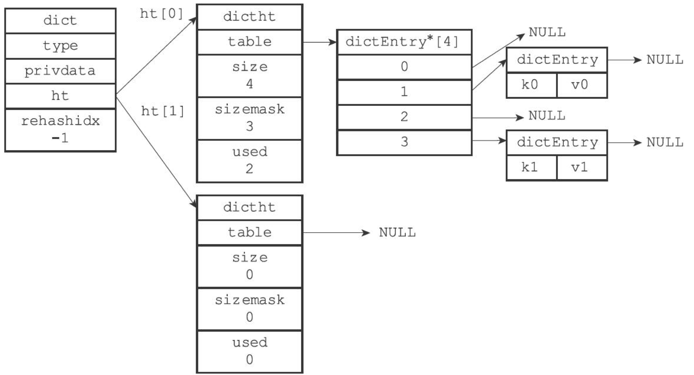

当字典被用作数据库的底层实现，或者哈希键的底层实现时，Redis使用MurmurHash2算法来计算键的哈希值。MurmurHash算法目前的最新版本为MurmurHash3，而Redis使用的是MurmurHash2，关于MurmurHash算法的更多信息可以参考该算法的主页：http://code.google.com/p/smhasher/。

#### 键冲突解决

当有两个或以上数量的键被分配到了哈希表数组的同一个索引上面时，我们称这些键发生了冲突（collision）。

Redis的哈希表使用链地址法（separatechaining）来解决键冲突，每个哈希表节点都有一个next指针，多个哈希表节点可以用next指针构成一个单向链表，被分配到同一个索引上的多个节点可以用这个单向链表连接起来，这就解决了键冲突的问题。

使用链表法解决键值冲突

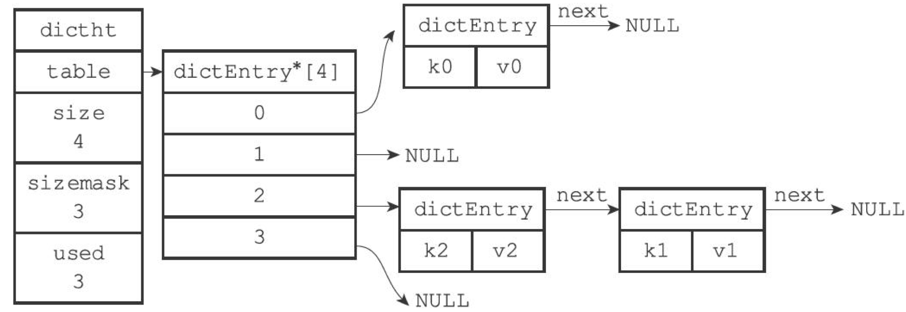

#### rehash

随着操作的不断执行，哈希表保存的键值对会逐渐地增多或者减少，为了让哈希表的负载因子（loadfactor）维持在一个合理的范围之内，当哈希表保存的键值对数量太多或者太少时，程序需要对哈希表的大小进行相应的扩展或者收缩。

扩展和收缩哈希表的工作可以通过执行rehash（重新散列）操作来完成，Redis对字典的哈希表执行rehash的步骤如下：

1. 为字典的ht[1]哈希表分配空间，这个哈希表的空间大小取决于要执行的操作，以及ht[0]当前包含的键值对数量（也即是ht[0].used属性的值）：

   * 如果执行的是扩展操作，那么ht[1]的大小为第一个大于等于ht[0].used*2的2n（2的n次方幂）；
   * 如果执行的是收缩操作，那么ht[1]的大小为第一个大于等于ht[0].used的2n。

   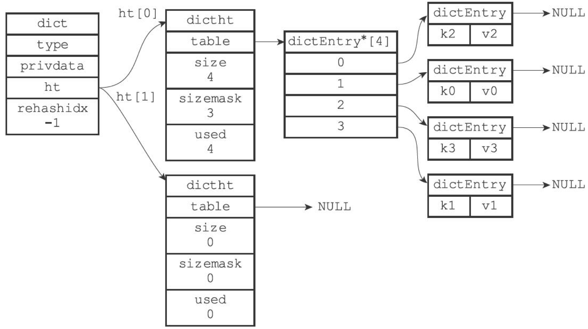

   > ht[0].used当前的值为4，4*2=8，而8（23）恰好是第一个大于等于4的2的n次方，所以程序会将ht[1]哈希表的大小设置为8。
   >

2. 将保存在ht[0]中的所有键值对rehash到ht[1]上面：rehash指的是重新计算键的哈希值和索引值，然后将键值对放置到ht[1]哈希表的指定位置上。

   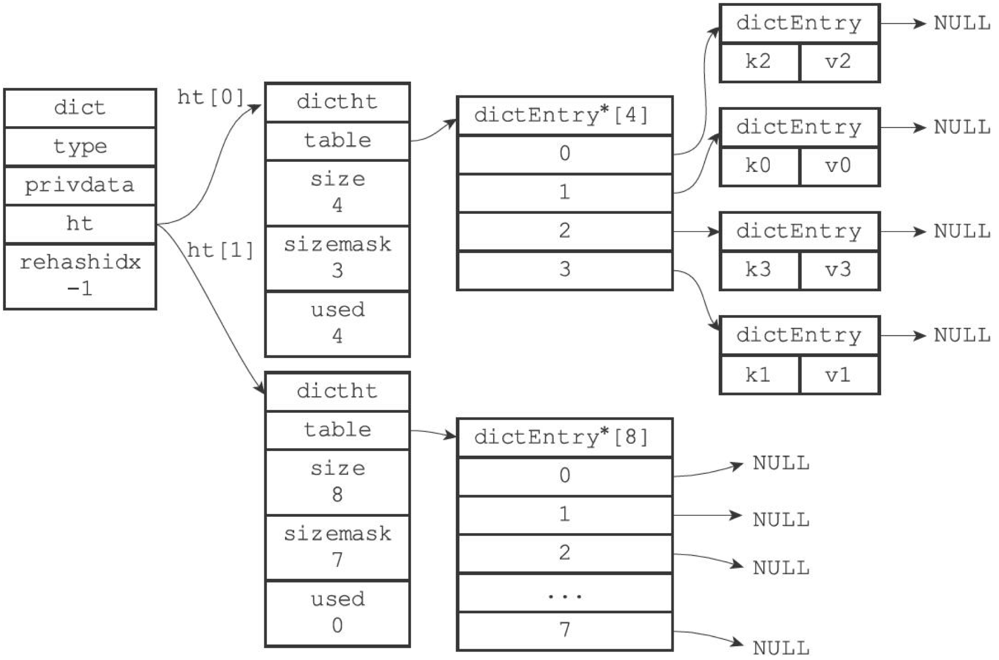

   > 将ht[0]包含的四个键值对都rehash到ht[1]
   >

3. 当ht[0]包含的所有键值对都迁移到了ht[1]之后（ht[0]变为空表），释放ht[0]，将ht[1]设置为ht[0]，并在ht[1]新创建一个空白哈希表，为下一次rehash做准备。

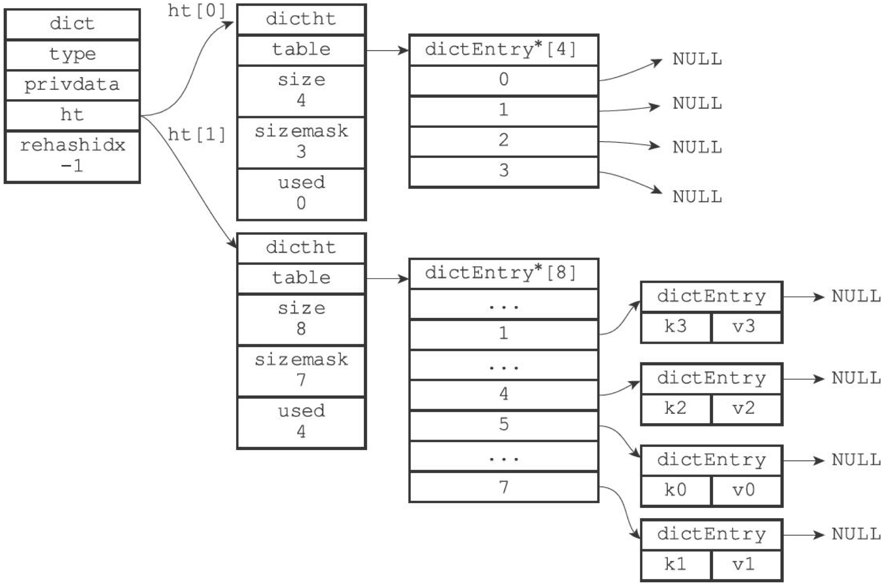

> 释放ht[0]，并将ht[1]设置为ht[0]，然后为ht[1]分配一个空白哈希表，

完成rehash之后的字典

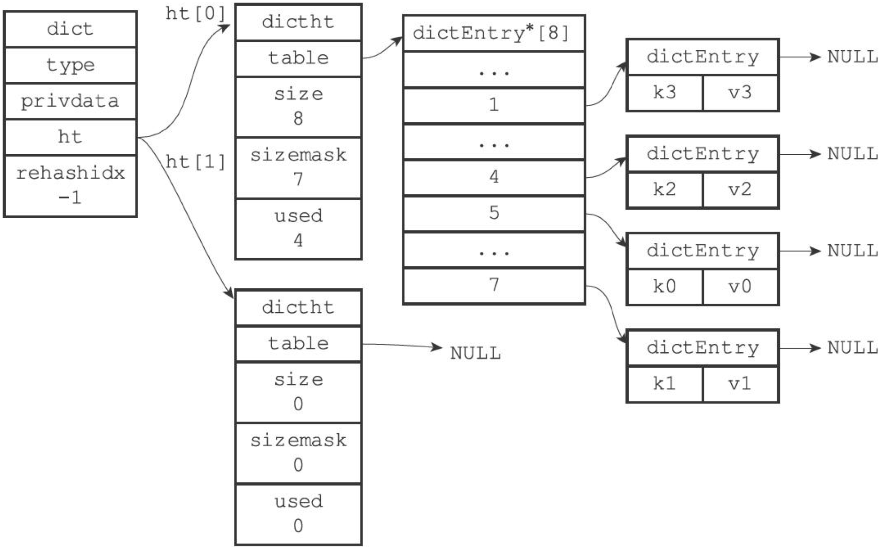

#### 哈希表的扩展与收缩

当以下条件中的任意一个被满足时，程序会自动开始对哈希表执行扩展操作：

1. 服务器目前没有在执行BGSAVE命令或者BGREWRITEAOF命令，并且哈希表的负载因子大于等于1。
2. 服务器目前正在执行BGSAVE命令或者BGREWRITEAOF命令，并且哈希表的负载因子大于等于5。

哈希表的负载因子可以通过公式：
```
负载因子 = 哈希表已保存节点数量 / 哈希表大小
load_factor = ht[0].used / ht[0].size
```

当哈希表的负载因子小于0.1时，程序自动开始对哈希表执行收缩操作。

#### 渐进式rehash

为了避免rehash对服务器性能造成影响，服务器不是一次性将ht[0]里面的所有键值对全部rehash到ht[1]，而是分多次、渐进式地将ht[0]里面的键值对慢慢地rehash到ht[1]。

以下是哈希表渐进式rehash的详细步骤：

1. 为ht[1]分配空间，让字典同时持有ht[0]和ht[1]两个哈希表
2. 在字典中维持一个索引计数器变量rehashidx，并将它的值设置为0，表示rehash工作正式开始。
3. 在rehash进行期间，每次对字典执行添加、删除、查找或者更新操作时，程序除了执行指定的操作以外，还会顺带将ht[0]哈希表在rehashidx索引上的所有键值对rehash到ht[1]，当rehash工作完成之后，程序将rehashidx属性的值增一。
4. 随着字典操作的不断执行，最终在某个时间点上，ht[0]的所有键值对都会被rehash至ht[1]，这时程序将rehashidx属性的值设为1，表示rehash操作已完成。

渐进式rehash的好处在于它采取分而治之的方式，将rehash键值对所需的计算工作均摊到对字典的每个添加、删除、查找和更新操作上，从而避免了集中式rehash而带来的庞大计算量。

##### 一次rehash的过程

1. 准备开始rehash

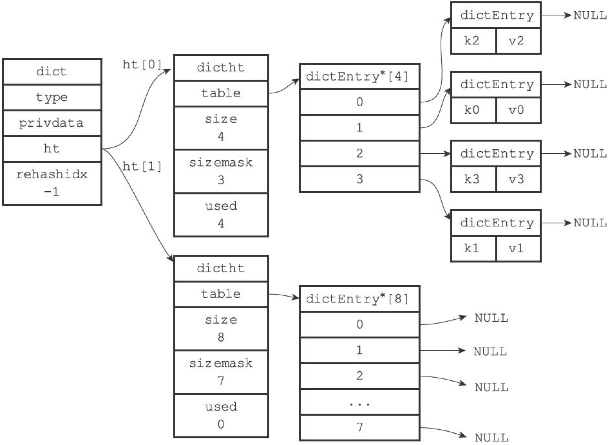

2. rehash索引0上的键值对

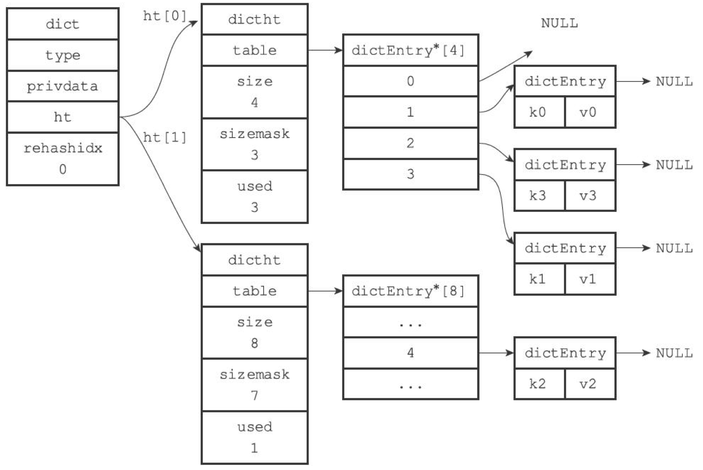

3. rehash索引1上的键值对

   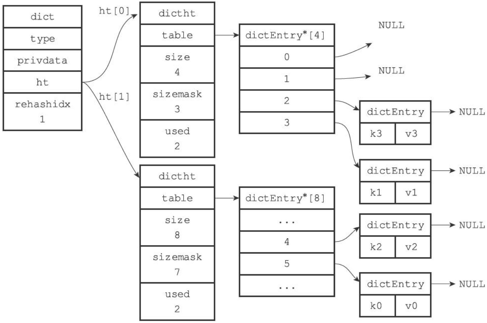

4. rehash索引2上的键值对

   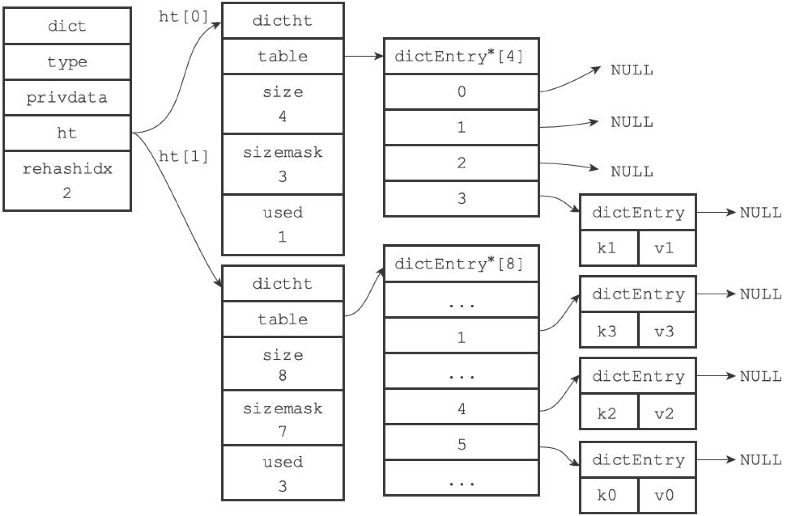

5. rehash索引3上的键值对

   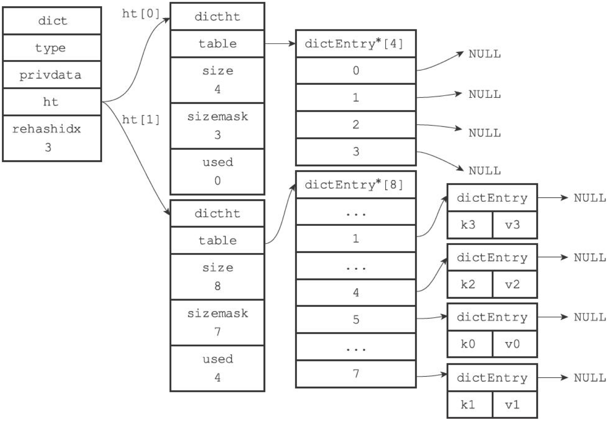

6. rehash结束

   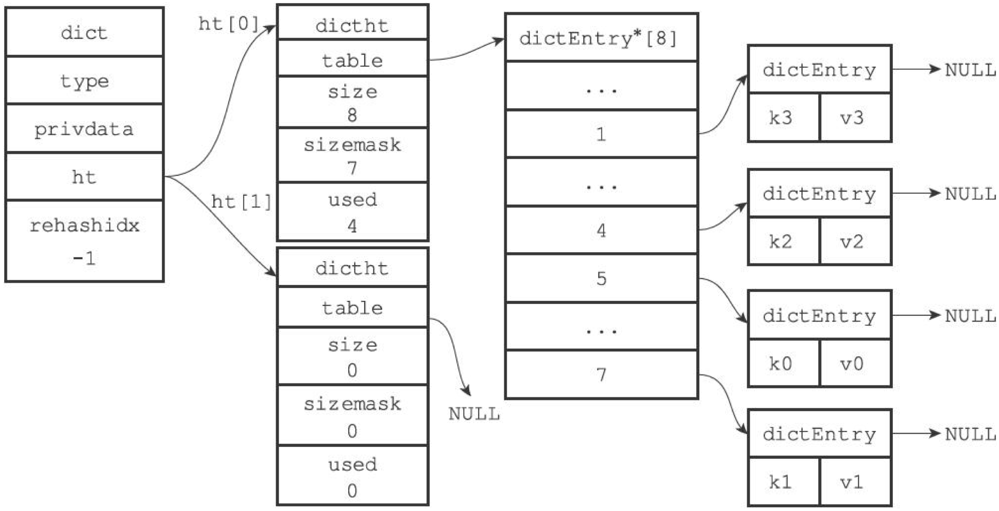

##### 渐进式rehash执行期间的哈希表操作

因为在进行渐进式rehash的过程中，字典会同时使用ht[0]和ht[1]两个哈希表，所以在渐进式rehash进行期间，字典的删除（delete）、查找（find）、更新（update）等操作会在两个哈希表上进行。例如，要在字典里面查找一个键的话，程序会先在ht[0]里面进行查找，如果没找到的话，就会继续到ht[1]里面进行查找，诸如此类。

另外，在渐进式rehash执行期间，新添加到字典的键值对一律会被保存到ht[1]里面，而ht[0]则不再进行任何添加操作，这一措施保证了ht[0]包含的键值对数量会只减不增，并随着rehash操作的执行而最终变成空表。


> 包含键值对的无序散列表            
> 添加、获取、移除单个键值对；获取所有的键值对
```bash
#在散列里面关联起给定的键值对
hset key field value
#获取指定散列键的值
hget key field
#获取散列包含的说有键值对
hgetall key
#如果给定键值存在于散列里面，那么移除这个键
hdel key field [field ...]
```
### ZSET (有序集合)

#### 跳跃表(skiplist)

跳跃表（skiplist）是一种有序数据结构，它通过在每个节点中维持多个指向其他节点的指针，从而达到快速访问节点的目的。

跳跃表支持平均O（logN）、最坏O（N）复杂度的节点查找，还可以通过顺序性操作来批量处理节点。

在大部分情况下，跳跃表的效率可以和平衡树相媲美，并且因为跳跃表的实现比平衡树要来得更为简单，所以有不少程序都使用跳跃表来代替平衡树。

Redis使用跳跃表作为有序集合键的底层实现之一，如果一个有序集合包含的元素数量比较多，又或者有序集合中元素的成员（member）是比较长的字符串时，Redis就会使用跳跃表来作为有序集合键的底层实现。

，Redis只在两个地方用到了跳跃表，一个是实现有序集合键，另一个是在集群节点中用作内部数据结构，除此之外，跳跃表在Redis里面没有其他用途。

##### 跳跃表的实现

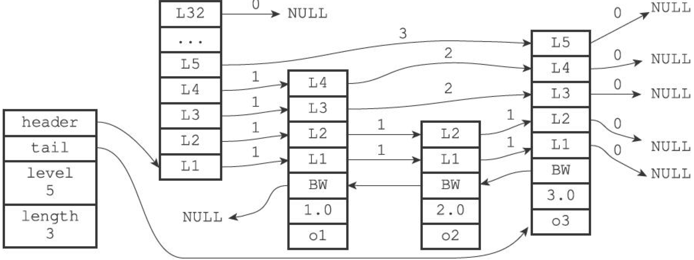

```c
// server.h
typedef struct zskiplistNode {
  // 各个节点中的o1、o2和o3是节点所保存的成员对象。
  sds ele;
  // 各个节点中的1.0、2.0和3.0是节点所保存的分值。在跳跃表中，节点按各自所保存的分值从小到大排列
  double score;
  // 节点中用BW字样标记节点的后退指针，它指向位于当前节点的前一个节点。后退指针在程序从表尾向表头遍历时使用。
  struct zskiplistNode *backward;
  // 节点中用L1、L2、L3等字样标记节点的各个层，L1代表第一层，L2代表第二层，以此类推。每个层都带有两个属性：前进指针和跨度。前进指针用于访问位于表尾方向的其他节点，而跨度则记录了前进指针所指向节点和当前节点的距离。在上面的图片中，连线上带有数字的箭头就代表前进指针，而那个数字就是跨度。当程序从表头向表尾进行遍历时，访问会沿着层的前进指针进行。
  struct zskiplistLevel {
    struct zskiplistNode *forward;
    unsigned long span;
  } level[];
} zskiplistNode;

typedef struct zskiplist {
  // header: 指向跳跃表的表头节点
  // tail: 指向跳跃表的表尾节点
  struct zskiplistNode *header, *tail;
  // 记录跳跃表的长度，也即是，跳跃表目前包含节点的数量（表头节点不计算在内）。
  unsigned long length;
  // 记录目前跳跃表内，层数最大的那个节点的层数（表头节点的层数不计算在内）
  int level;
} zskiplist;

typedef struct zset {
  dict *dict;
  zskiplist *zsl;
} zset;
```


> 字符串成员与浮点数分值之间的有序映射，元素的排列顺序由分值的大小决定    
> 
> 添加、获取、删除单个元素；根据分值范围(range)或者成员来获取元素
```bash
# 将一个给定分值的成员添加到有序集合里面
zadd key [NX|XX] [CH] [INCR] score member [score member ...]
# 根据元素在有序排列中所处的位置，从有序集合里面获取多个元素
zrange key start stop [WITHSCORES]
# 获取有序集合在给定分值范围内的所有元素
zrangebyscore key min max [WITHSCORES] [LIMIT offset count]
# 如果给定成员存在于有序集合，那么移除这个成员
zrem key member [member ...]
```


### 压缩列表

* 压缩列表是一种为节约内存而开发的顺序型数据结构。
* 压缩列表被用作列表键和哈希键的底层实现之一。
* 压缩列表可以包含多个节点，每个节点可以保存一个字节数组或者整数值。
* 添加新节点到压缩列表，或者从压缩列表中删除节点，可能会引发连锁更新操作，但这种操作出现的几率并不高。


### 6. Other 命令

1. expirs. (有效期)


## 消息模式


## 事务


## 持久化	

### RDB持久化

#### RDB文件的创建与载入


##### 创建

有两个Redis命令可以用于生成RDB文件，一个是SAVE，另一个是BGSAVE。

* SAVE命令会阻塞Redis服务器进程，直到RDB文件创建完毕为止，在服务器进程阻塞期间，服务器不能处理任何命令请求

* BGSAVE命令会派生出一个子进程，然后由子进程负责创建RDB文件，服务器进程（父进程）继续处理命令请求

##### 载入

服务器在载入RDB文件期间，会一直处于阻塞状态，直到载入工作完成为止。

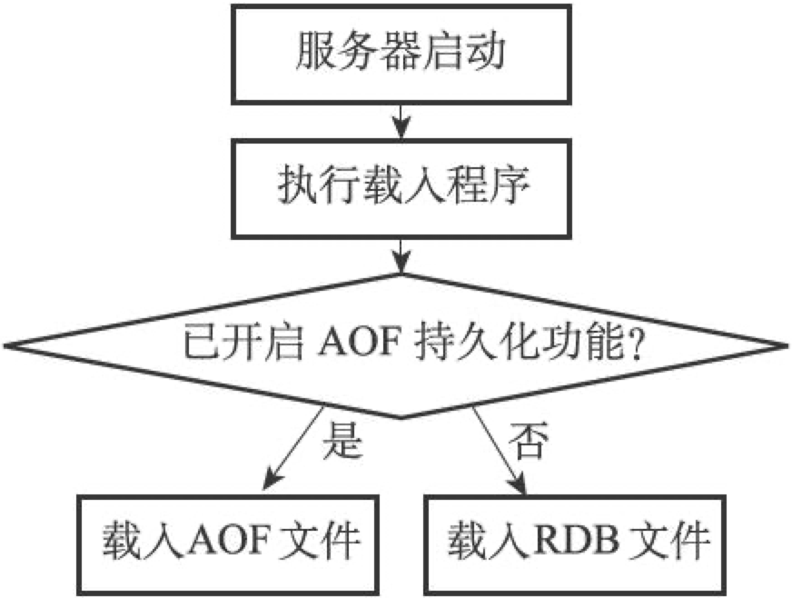


#### 自动间隔性保存

Redis的服务器周期性操作函数serverCron默认每隔100毫秒就会执行一次，该函数用于对正在运行的服务器进行维护，它的其中一项工作就是检查save选项所设置的保存条件是否已经满足，如果满足的话，就执行BGSAVE命令。


#### RDB文件结构

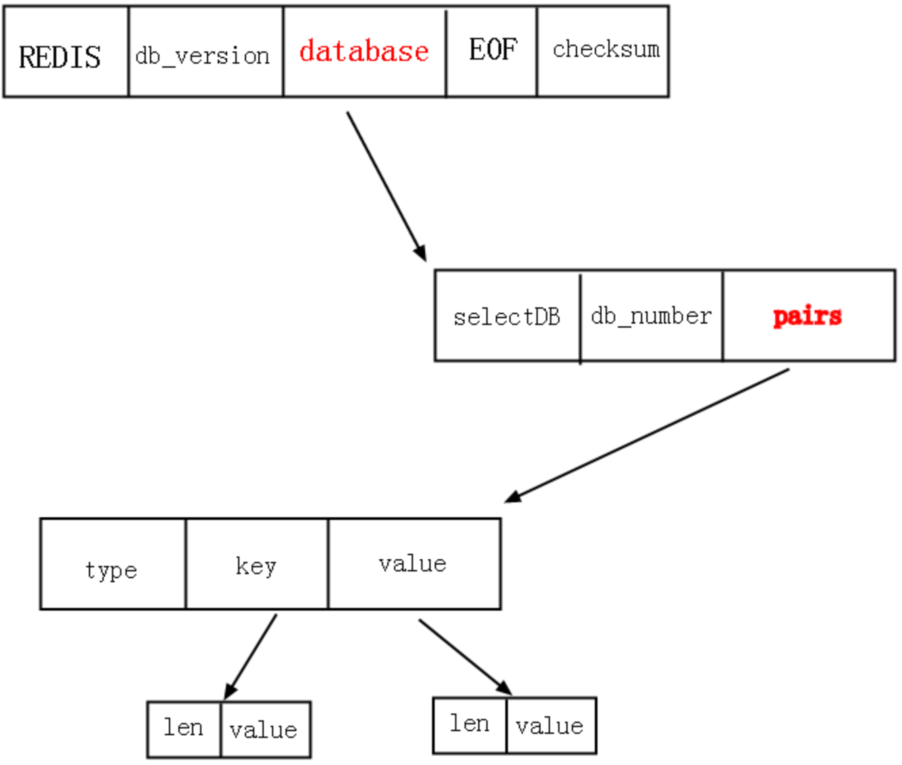

1. RDB文件的最开头是REDIS部分，这个部分的长度为5字节，保存着“REDIS”五个字符。通过这五个字符，程序可以在载入文件时，快速检查所载入的文件是否RDB文件。
2. db_version长度为4字节，它的值是一个字符串表示的整数，这个整数记录了RDB文件的版本号，比如"0006"就代表RDB文件的版本为第六版。本章只介绍第六版RDB文件的结构。(当前介绍版本为第六版)

3. databases部分包含着零个或任意多个数据库，以及各个数据库中的键值对数据
   1. 如果服务器的数据库状态为空（所有数据库都是空的），那么这个部分也为空，长度为0字节。
   2. 如果服务器的数据库状态为非空（有至少一个数据库非空），那么这个部分也为非空，根据数据库所保存键值对的数量、类型和内容不同，这个部分的长度也会有所不同。
4. EOF常量的长度为1字节，这个常量标志着RDB文件正文内容的结束，当读入程序遇到这个值的时候，它知道所有数据库的所有键值对都已经载入完毕了。

5. check_sum是一个8字节长的无符号整数，保存着一个校验和，这个校验和是程序通过对REDIS、db_version、databases、EOF四个部分的内容进行计算得出的。服务器在载入RDB文件时，会将载入数据所计算出的校验和与check_sum所记录的校验和进行对比，以此来检查RDB文件是否有出错或者损坏的情况出现。

#### 分析RDB文件
我们使用[[linux#od|od]]命令来分析Redis服务器产生的RDB文件，该命令可以用给定的格式转存（dump）并打印输入文件。
```bash
od -c dump.rdb    # 使用od命令打印文件值
```

### AOF 持久化

AOF（AppendOnlyFile）持久化功能。与RDB持久化通过保存数据库中的键值对来记录数据库状态不同，AOF持久化是通过保存Redis服务器所执行的写命令来记录数据库状态的


#### AOF 持久化的实现
AOF持久化功能的实现可以分为命令追加（append）、文件写入、文件同步（sync）三个步骤。

##### 追加
当AOF持久化功能处于打开状态时，服务器在执行完一个写命令之后，会以协议格式将被执行的写命令追加到服务器状态的aof_buf缓冲区的末尾.

##### 写入与同步
Redis的服务器进程就是一个事件循环（loop），这个循环中的文件事件负责接收客户端的命令请求，以及向客户端发送命令回复，而时间事件则负责执行像serverCron函数这样需要定时运行的函数。

因为服务器在处理文件事件时可能会执行写命令，使得一些内容被追加到aof_buf缓冲区里面，所以在服务器每次结束一个事件循环之前，它都会调用flushAppendOnlyFile函数，考虑是否需要将aof_buf缓冲区中的内容写入和保存到AOF文件里面。

> 为了提高文件的写入效率，在现代操作系统中，当用户调用write函数，将一些数据写入到文件的时候，操作系统通常会将写入数据暂时保存在一个内存缓冲区里面，等到缓冲区的空间被填满、或者超过了指定的时限之后，才真正地将缓冲区中的数据写入到磁盘里面。这种做法虽然提高了效率，但也为写入数据带来了安全问题，因为如果计算机发生停机，那么保存在内存缓冲区里面的写入数据将会丢失。为此，系统提供了fsync和fdatasync两个同步函数，它们可以强制让操作系统立即将缓冲区中的数据写入到硬盘里面，从而确保写入数据的安全性。

##### 效率与安全性

服务器配置appendfsync选项的值直接决定AOF持久化功能的效率和安全性。
* 当appendfsync的值为always时，服务器在每个事件循环都要将aof_buf缓冲区中的所有内容写入到AOF文件，并且同步AOF文件，所以always的效率是appendfsync选项三个值当中最慢的一个，但从安全性来说，always也是最安全的，因为即使出现故障停机，AOF持久化也只会丢失一个事件循环中所产生的命令数据。
* 当appendfsync的值为everysec时，服务器在每个事件循环都要将aof_buf缓冲区中的所有内容写入到AOF文件，并且每隔一秒就要在子线程中对AOF文件进行一次同步。从效率上来讲，everysec模式足够快，并且就算出现故障停机，数据库也只丢失一秒钟的命令数据。
* 当appendfsync的值为no时，服务器在每个事件循环都要将aof_buf缓冲区中的所有内容写入到AOF文件，至于何时对AOF文件进行同步，则由操作系统控制。因为处于no模式下的flushAppendOnlyFile调用无须执行同步操作，所以该模式下的AOF文件写入速度总是最快的，不过因为这种模式会在系统缓存中积累一段时间的写入数据，所以该模式的单次同步时长通常是三种模式中时间最长的。从平摊操作的角度来看，no模式和everysec模式的效率类似，当出现故障停机时，使用no模式的服务器将丢失上次同步AOF文件之后的所有写命令数据。

#### 文件的载入与数据的还原

1. 创建一个不带网络连接的伪客户端（fakeclient）：因为Redis的命令只能在客户端上下文中执行，而载入AOF文件时所使用的命令直接来源于AOF文件而不是网络连接，所以服务器使用了一个没有网络连接的伪客户端来执行AOF文件保存的写命令，伪客户端执行命令的效果和带网络连接的客户端执行命令的效果完全一样。
2. 从AOF文件中分析并读取出一条写命令。
3. 使用伪客户端执行被读出的写命令。
4. 一直执行步骤2和步骤3，直到AOF文件中的所有写命令都被处理完毕为止。

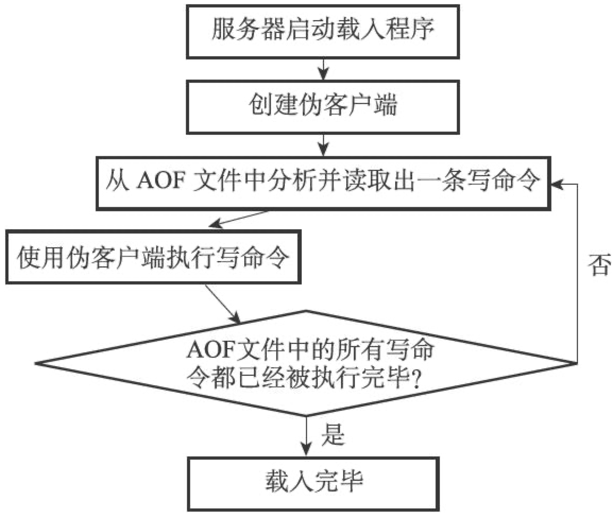

#### AOF重写

因为AOF持久化是通过保存被执行的写命令来记录数据库状态的，所以随着服务器运行时间的流逝，AOF文件中的内容会越来越多，文件的体积也会越来越大，如果不加以控制的话，体积过大的AOF文件很可能对Redis服务器、甚至整个宿主计算机造成影响，并且AOF文件的体积越大，使用AOF文件来进行数据还原所需的时间就越多。

为了解决AOF文件体积膨胀的问题，Redis提供了AOF文件重写（rewrite）功能。通过该功能，Redis服务器可以创建一个新的AOF文件来替代现有的AOF文件，新旧两个AOF文件所保存的数据库状态相同，但新AOF文件不会包含任何浪费空间的冗余命令，所以新AOF文件的体积通常会比旧AOF文件的体积要小得多。


## 集群


## 运维

### 服务器中的数据库

```bash
CONFIG GET databases  	# 了解数据库的数量
INFO keyspace     			# 列出已定义某些键的数据库

select 1    						# 切换数据库
```


## 补充
redis 集群服务器推荐3主3从
