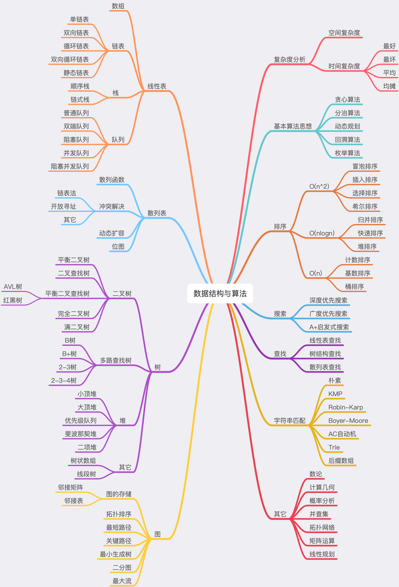

# 数据结构与算法

## 简介



## 复杂度分析

### 大O复杂度表示法

*所有代码的执行时间 T(n) 与每行代码的执行次数 n 成正比*

$$T(n)=O(f(n))$$

$$T(n)$$ 代码执行的时间, $$n$$ 数据规模的大小, $$f(n)$$ 表示每行代码执行的次数总和, $$O$$ 表示代码的执行时间 T(n) 与 f(n) 表达式成正比


### 时间复杂度分析

#### 1. 只关注循环执行次数最多的一段代码

#### 2. 加法法则：总复杂度等于量级最大的那段代码的复杂度

#### 3. 乘法法则：嵌套代码的复杂度等于嵌套内外代码复杂度的乘积


### 几种常见的时间复杂度实例分析

####  O(1)

只要算法中不存在循环语句、递归语句，即使有成千上万行的代码，其时间复杂度也是Ο(1)

#### O(logn)、O(nlogn)

```c
// 例子1
i=1;
while (i <= n)  {
  i = i * 2;
}

// 例子2
i=1;
while (i <= n)  {
  i = i * 3;
}

```

例子1的时间复杂度 $$O(log_2n)$$， 例子2的时间复杂度为$$O(log_3n)$$，不管是以 2 为底、以 3 为底，还是以 10 为底，我们可以把所有对数阶的时间复杂度都记为 O(logn)

$log_3n=log_32*log_2n$
$C=log_32$
$O(log_3n)=O(C*log_2n)$
$O(Cf(n))=O(f(n))$


如果一段代码的时间复杂度是 O(logn)，我们循环执行 n 遍，时间复杂度就是 O(nlogn) 了。而且，O(nlogn) 也是一种非常常见的算法时间复杂度。比如，归并排序、快速排序的时间复杂度都是 O(nlogn)。

>  **换底公式**
> $log_ab=\frac{log_cb}{log_ca} \qquad (c>0 \ c\neq1)$
> **证明**
> 设 $log_ab=x$
> $b = a^x$
> $log_cb=log_ca^x$
> $log_cb=xlog_ca$
> $x=\frac{log_cb}{log_ca}$


$log_3n=log_32*log_2n$ 

$log_32=\frac{log_2n}{log_3n}$


缓存算法（页面置换算法）

* FIFO（First In，First Out）先进先出策略 
*  LFU（Least Frequently Used）最少使用策略
* LRU（Least Recently Used）最近最少使用策略


## 其它

### 限流算法
#### 令牌桶算法
令牌桶算法是一个存放固定容量令牌的桶，按照固定速率往桶里添加令牌

- 假设限制速率为2r/s，则按照500毫秒的速率往令牌桶添加令牌
- 令牌桶最多存放b个令牌，当桶满的时候，新的令牌会被抛弃或拒绝
- 当一个n个字节大小的数据包到达，将从桶中删除n个令牌，接着发送数据包到网络上
- 如果桶中的流量不足n个，则不会删除令牌，该数据将被限流（要么丢弃，要么缓存）


#### 漏桶算法
漏桶算法是网络世界中流量整形（Traffic Shaping）或速率限制（Rate Limiting）时经常使用的一种算法
- 一个固定容量的漏桶，按照常量固定速率流出水滴
- 如果桶是空的，则不需要流出水滴
- 可以以任意速率流入水滴到漏桶
- 如果流出水滴超出了桶的容量，则流入的水滴溢出（被丢弃），则漏桶的容量是不变的